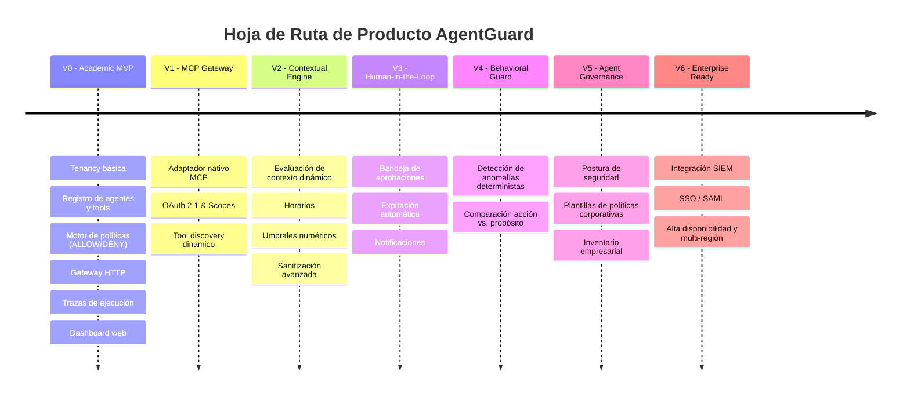

# Product Brief — AgentGuard
**Plataforma de Autorización Contextual y Gobernanza en Tiempo de Ejecución para Agentes de IA**  
*Versión 2.0 — Propuesta Académica y de Producto Validada*  
*Fecha: Septiembre 2026*

---

## 1. Resumen Ejecutivo (Executive Summary)

AgentGuard es una plataforma de software multi-tenant e independiente del proveedor de IA (LLM-agnostic) diseñada para **autorizar, bloquear, someter a aprobación humana y auditar** en tiempo real las acciones que los agentes de inteligencia artificial ejecutan sobre herramientas empresariales, APIs y bases de datos.

La formulación y principio rector de AgentGuard es:
> **«IAM responde quién eres; AgentGuard decide qué puedes hacer ahora».**

A diferencia de las soluciones tradicionales de gestión de identidades y accesos (IAM), que operan con permisos estáticos a nivel de actor, AgentGuard modela **al menos cinco dimensiones contextuales** para cada decisión:
1. **Identidad del Agente (`Principal`)**: Qué agente solicita la ejecución y cuál es su conjunto autorizado de capacidades.
2. **Delegador (`Delegator/User`)**: Usuario humano u organización en cuyo nombre actúa el agente.
3. **Acción Concreta (`Action`)**: Operación atómica invocada (ej. `create_quote`, `refund`, `delete_database`, `export_customers`).
4. **Recurso Afectado (`Resource`)**: Objeto o destino específico sobre el que recae la acción (ej. `customer/4589`, `table:financial_records`).
5. **Contexto de Ejecución (`Context`)**: Horario, importe monetario, red/origen, nivel de riesgo, sesión y entorno.

El resultado de cada evaluación es determinista: **`ALLOW`** (permitir), **`DENY`** (bloquear y alertar) o **`REQUIRE_APPROVAL`** (suspender temporalmente la ejecución a la espera de intervención humana vía HITL).

---

## 2. Definición del Problema (Business & Technical Problem)

### 2.1 La Frontera de Seguridad Agentic
Los agentes autónomos de IA han dejado de ser simples modelos generativos de texto conversacional: ahora razonan, planifican, encadenan herramientas, consultan bases de datos, modifican registros financieros y ejecutan código. Esto crea una frontera de ataque completamente nueva:
- **Goal Hijacking / Prompt Injection Indirecta**: Instrucciones maliciosas ocultas en datos externos (emails, PDFs, páginas web) manipulan el razonamiento del agente para inducirlo a realizar acciones fuera de su diseño.
- **Tool Misuse & Excessive Agency**: Agentes que ejecutan acciones con parámetros destructivos o invocan herramientas innecesarias para su objetivo (riesgos documentados por **OWASP Top 10 for Agentic Applications 2026**).
- **Identity & Privilege Abuse**: Falta de límites claros entre los permisos del usuario final y las capacidades asignadas al agente, provocando ataques de tipo *Confused Deputy*.

### 2.2 Evidencia Operacional de Mercado (Estudios CSA 2026)
La necesidad que resuelve AgentGuard está respaldada por datos operacionales de la **Cloud Security Alliance (CSA)**:
- **53%** de las empresas encuestadas reportó que sus agentes de IA excedieron los permisos previstos en producción.
- **47%** experimentó al menos un incidente de seguridad atribuible directamente a la actuación de un agente.
- **68%** de los profesionales de seguridad admitió no tener capacidad técnica para distinguir en sus logs las acciones ejecutadas por humanos de las ejecutadas por agentes.

---

## 3. Propuesta de Valor y Principios de Diseño

### 3.1 Propuesta de Valor
> *«AgentGuard permite a las organizaciones desplegar agentes de IA con autonomía operativa real sin concederles carta blanca. Intercepta las llamadas a herramientas, evalúa políticas contextuales en tiempo real, bloquea accesos no autorizados, escala operaciones críticas a aprobación humana y genera una bitácora de auditoría inmutable de cada decisión.»*

### 3.2 Principios de Diseño del Producto
1. **Least Privilege (Mínimo Privilegio)**: Cada agente dispone únicamente de las herramientas (`AgentTool`) y acciones estrictamente indispensables para su propósito.
2. **Never Trust the Model as Enforcement Point**: El modelo de lenguaje propone la acción; **AgentGuard decide si la acción se ejecuta**. La frontera de seguridad jamás reside dentro del prompt ni dentro del LLM.
3. **Policy Outside the Agent**: Las reglas de autorización son externas, configurables por el administrador y de evaluación estrictamente determinista (sin inferencias probabilísticas en el núcleo de decisión).
4. **Context-Aware Authorization**: Una misma herramienta (ej. `refund`) puede ser permitida automáticamente si el monto es menor a $500 en horario comercial, pero requerir aprobación de un supervisor si supera dicho umbral.
5. **Human-in-the-Loop (HITL) Nativo**: La intervención humana no es un parche operativo, sino un efecto legítimo de primer nivel dentro del motor de políticas (`REQUIRE_APPROVAL`).
6. **Auditability & Trazabilidad Inmutable**: Cada llamada produce un `Execution Trace` con identificadores únicos, sanitizando credenciales y protegiendo la privacidad.
7. **Standards-First (MCP & OAuth 2.1)**: Adopción del estándar abierto **Model Context Protocol (MCP)** como primera superficie de integración en lugar de inventar protocolos propietarios.

---

## 4. Análisis Competitivo y Posicionamiento

| Actor / Solución | Enfoque Principal | Lo que NO es AgentGuard | Espacio y Diferencial de AgentGuard |
| :--- | :--- | :--- | :--- |
| **Microsoft Entra Agent ID** | Gestión de identidades, ciclo de vida y gobierno enterprise para agentes en ecosistema Microsoft. | No busca reemplazar el directorio de identidades corporativo. | Capa desacoplada, independiente del proveedor, con foco en **decisiones contextuales sobre herramientas** y simulación interactiva. |
| **AWS Bedrock AgentCore Identity** | Identidad, autenticación y credenciales acopladas a AWS. | No es un proveedor de nube ni un gestor de infraestructura AWS. | Enforcement y gobernanza **multi-cloud y local**, aplicable a cualquier LLM (OpenAI, Anthropic, Ollama, local models). |
| **Noma Security / Zenity** | Plataformas enterprise complejas de postura de seguridad (ASPM) y runtime. | No pretende ser una suite enterprise monolítica de ciberseguridad global. | **Implementación acotada, explicable, demostrable y pedagógica** centrada en runtime gateway, políticas deterministas y playground de pruebas. |
| **Open Policy Agent (OPA) / Cedar** | Motores genéricos de evaluación de políticas de código abierto. | No reinventa la teoría general de políticas. | AgentGuard aporta el **dominio especializado de agentes de IA**, el proxy de interceptación MCP/REST, la bandeja HITL y la experiencia de usuario (UX). |

---

## 5. Diferenciación Clave

1. **Autorización Contextual por Acción**: La autorización no se concede a nivel global de herramienta, sino a nivel de la acción atómica (`ToolAction`) evaluando parámetros y atributos contextuales.
2. **Delegación Trazable**: Preserva la cadena completa de delegación: $\text{Usuario} \rightarrow \text{Agente} \rightarrow \text{Tarea} \rightarrow \text{Herramienta} \rightarrow \text{Recurso}$.
3. **Enforcement Blindado contra Prompt Injection**: Aunque un atacante manipule completamente las instrucciones internas del agente, AgentGuard actúa como un firewall externo infranqueable.
4. **Playground de Simulación y Explicabilidad**: Entorno interactivo donde desarrolladores y auditores prueban escenarios antes de pasarlos a producción, visualizando el motivo exacto de cada decisión.

---

## 6. Segmentos de Usuarios y Casos de Uso Clave

### 6.1 Personas
- **CISO / Ingeniero de Seguridad (SecOps)**: Define políticas de riesgo, supervisa incidentes y revisa auditorías.
- **Aprobador de Negocio / Operador**: Revisa y resuelve solicitudes de alta sensibilidad pendientes de aprobación (HITL).
- **Desarrollador de Agentes / AI Engineer**: Registra nuevos agentes, enlaza herramientas (MCP/REST) y valida el comportamiento en el Playground.
- **Administrador de la Organización**: Administra usuarios, tenancies y membresías.

### 6.2 Escenarios de Uso Representativos
- **Agente de Ventas**: Autorizado para consultar inventario y emitir presupuestos por montos menores a $10.000; denegado para modificar listas maestras de precios o borrar clientes.
- **Agente Financiero**: Autorizado para procesar reembolsos automáticos menores a $500; montos superiores escalan automáticamente a `REQUIRE_APPROVAL`.
- **Intento de Exfiltración de Datos (Prompt Injection)**: Un agente comprometido intenta llamar a `export_customers` hacia un servidor externo; AgentGuard intercepta la llamada, genera `DENY` y emite una alerta crítica de seguridad inmediata.

---

## 7. Roadmap de Evolución del Producto

---

## 8. Criterios de Éxito del Producto

1. **Garantía de No Invocación en `DENY`**: Ninguna llamada denegada por política alcanza jamás la herramienta externa.
2. **Latencia Despreciable**: Tiempo medio de evaluación del Policy Decision Point inferior a 20 ms.
3. **Auditabilidad Completa**: El 100% de las solicitudes cuenta con un `Execution Trace` correlacionable con timestamp, identificador de regla y contexto sanitizado.
4. **Defensa Académica y Demostrabilidad**: Demostración verificable en vivo mediante una secuencia de cuatro escenarios reproducibles (Operación Normal, Operación Prohibida, Operación Sensible con Aprobación, y Ataque de Prompt Injection Bloqueado).

---

## 9. Declaración de Cierre y Frase de Defensa

> **«No estamos construyendo otro chatbot ni otro sistema IAM tradicional. Estamos construyendo una frontera externa de autorización en tiempo de ejecución para agentes de IA: el agente propone qué hacer, pero AgentGuard garantiza que solo ejecute lo que tiene permitido en ese instante.»**
