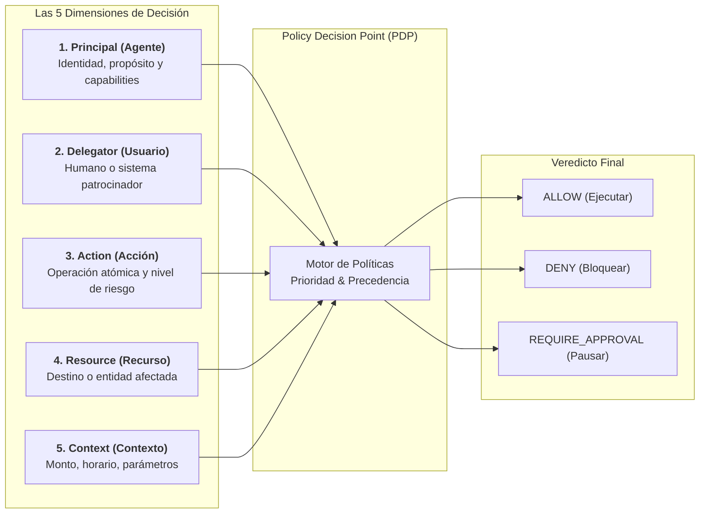
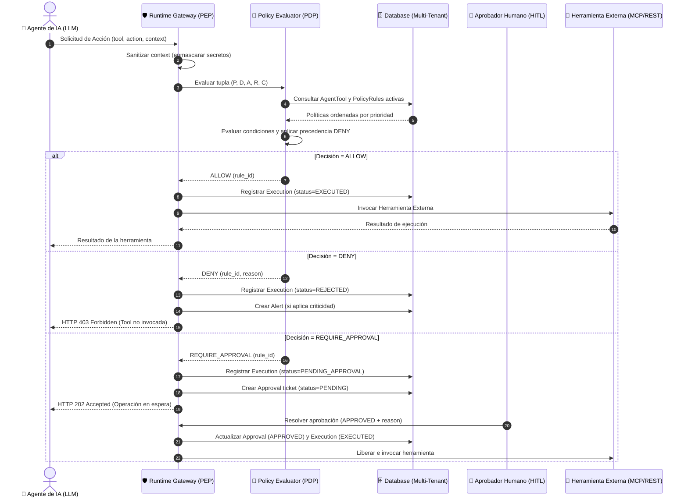

# Modelo de Autorización Contextual — AgentGuard
**Plataforma de Autorización Contextual y Gobernanza en Tiempo de Ejecución para Agentes de IA**  
*Versión 2.0 — Especificación Formal del Modelo de Control de Acceso y Enforcement*  
*Código de Documento: AG-AM-03*

---

## 1. Paradigma de Autorización: Más allá del IAM Tradicional

Los modelos tradicionales de control de acceso basados en roles (**RBAC - Role-Based Access Control**) fueron concebidos para usuarios humanos que interactúan con pantallas y formularios conocidos. En un entorno agéntico, este enfoque resulta insuficiente y peligroso por tres razones estructurales:
1. **Acciones no lineales y encadenadas**: Un agente de IA descompone una meta en una secuencia impredecible de invocaciones a herramientas (*Tool Calling*).
2. **El riesgo del agente como ejecutor intermediario (*Confused Deputy*)**: El modelo de lenguaje puede poseer credenciales amplias para operar en un sistema, pero ser inducido a través de instrucciones maliciosas (*Prompt Injection*) a abusar de esas credenciales.
3. **Pérdida de la frontera de decisión interna**: Jamás se debe delegar la seguridad al propio LLM mediante prompts del tipo *"Verifica si el usuario puede hacer esto antes de ejecutar la tool"*. La frontera de seguridad debe residir **fuera del modelo**.

Por ello, AgentGuard implementa un modelo **ABAC (Attribute-Based Access Control) Contextual de Tiempo de Ejecución**:
> **«IAM responde quién eres; AgentGuard decide qué puedes hacer ahora».**

---

## 2. La Tupla Canónica de Decisión (5 Dimensiones)

Cada solicitud de ejecución es procesada por el motor de decisión a través de una función determinista de cinco dimensiones:

$$\text{Decisión} = f(\mathcal{P}, \mathcal{D}, \mathcal{A}, \mathcal{R}, \mathcal{C})$$



### Detalle de las Dimensiones:
1. **Principal ($\mathcal{P}$ - Agente de IA)**:
   - Identificador UUID del agente (`Agent.id`).
   - Estado operativo (`Agent.status == ACTIVE`).
   - Conjunto de herramientas autorizadas en la tabla `AgentTool`.
2. **Delegador ($\mathcal{D}$ - Delegator / User)**:
   - Usuario humano en cuyo nombre actúa el agente (`delegator_user_id`).
   - Rol del usuario en la organización (`ADMIN`, `OPERATOR`, `APPROVER`).
3. **Acción ($\mathcal{A}$ - ToolAction)**:
   - Identificador de la acción atómica (`ToolAction.id`).
   - Nivel de riesgo tipificado (`risk_level`: `LOW`, `MEDIUM`, `HIGH`, `CRITICAL`).
4. **Recurso ($\mathcal{R}$ - Resource)**:
   - Identificador del objeto, tabla, registro o endpoint receptor (ej. `customer/4589`, `table:salaries`).
5. **Contexto ($\mathcal{C}$ - Context)**:
   - Parámetros dinámicos de la invocación: importe monetario (`amount`), destino de red (`destination`), ventana temporal (`time`), entorno de ejecución (`environment`).

---

## 3. Arquitectura PDP / PEP y Flujo de Interceptación

AgentGuard implementa el estándar arquitectónico de seguridad **XACML / NIST**:
- **PEP (Policy Enforcement Point)**: El *Agent Runtime Gateway*, intercepta la llamada, extrae los parámetros, consulta al PDP y ejecuta el bloqueo físico si la decisión no es `ALLOW`.
- **PDP (Policy Decision Point)**: El *Policy Evaluator*, consulta las políticas activas en la base de datos, aplica las condiciones contextuales y resuelve la decisión determinista.
- **PIP (Policy Information Point)**: El repositorio de metadatos multi-tenant (tablas `AgentTool`, `ToolAction`, `User`).
- **PAP (Policy Administration Point)**: La interfaz web y API donde los administradores configuran políticas y reglas.



---

## 4. Estructura y Sintaxis de Políticas

Las políticas se modelan en base de datos mediante la relación `Policy` (1) $\rightarrow$ `PolicyRule` (N).

### 4.1 Formato del Campo `conditions` (JSONB)
El motor de evaluación admite operadores lógicos y de comparación sobre cualquier atributo presente en `request_context` o atributos del entorno:

| Operador | Tipo | Descripción | Ejemplo |
| :--- | :--- | :--- | :--- |
| **`$eq` / `$ne`** | Comparación | Igualdad / Desigualdad | `{"currency": {"$eq": "USD"}}` |
| **`$lt` / `$lte`** | Comparación | Menor que / Menor o igual | `{"amount": {"$lt": 10000}}` |
| **`$gt` / `$gte`** | Comparación | Mayor que / Mayor o igual | `{"amount": {"$gte": 500}}` |
| **`$in` / `$nin`** | Conjunto | Pertenencia a lista | `{"destination": {"$in": ["internal", "partner"]}}` |
| **`$regex`** | Patrón | Expresión regular | `{"resource": {"$regex": "^customer/[0-9]+$"}}` |
| **`$and` / `$or`** | Lógico | Conjunción / Disyunción | `{"$and": [{"amount": {"$lt": 500}}, {"time.hour": {"$gte": 8}}]}` |

### 4.2 Ejemplos Canónicos de Reglas del Sistema

#### Regla 1: Operación Comercial de Ventas bajo Umbral (`ALLOW`)
```json
{
  "policy_name": "Política Comercial Estándar",
  "priority": 100,
  "rule": {
    "priority": 50,
    "effect": "ALLOW",
    "tool_action": "create_quote",
    "target_agent": null,
    "conditions": {
      "amount": { "$lt": 10000.00 }
    }
  }
}
```

#### Regla 2: Prohibición de Modificación de Precios para Ventas (`DENY`)
```json
{
  "policy_name": "Protección de Precios Maestros",
  "priority": 200,
  "rule": {
    "priority": 100,
    "effect": "DENY",
    "tool_action": "update_price",
    "target_agent": "sales-agent-uuid",
    "conditions": {}
  }
}
```

#### Regla 3: Reembolso Financiero con Intervención Humana (`REQUIRE_APPROVAL`)
```json
{
  "policy_name": "Control de Egresos Financieros",
  "priority": 150,
  "rule": {
    "priority": 80,
    "effect": "REQUIRE_APPROVAL",
    "tool_action": "refund",
    "target_agent": null,
    "conditions": {
      "amount": { "$gte": 500.00 }
    }
  }
}
```

#### Regla 4: Bloqueo de Exfiltración de Datos hacia Destino Externo (`DENY + ALERT`)
```json
{
  "policy_name": "Prevención de Fuga de Datos (DLP)",
  "priority": 300,
  "rule": {
    "priority": 200,
    "effect": "DENY",
    "tool_action": "export_customers",
    "target_agent": null,
    "conditions": {
      "destination": { "$ne": "internal_compliance_vault" }
    }
  }
}
```

---

## 5. Algoritmo de Evaluación y Resolución de Conflictos

El motor de decisión ejecuta los siguientes pasos de forma secuencial y determinista:

```python
def evaluate_decision(organization_id, agent_id, delegator_user_id, tool_id, tool_action_id, resource, context):
    # Paso 1: Verificar existencia y estado del agente
    agent = db.get_agent(agent_id, organization_id)
    if not agent or agent.status != "ACTIVE":
        return DecisionResult(effect="DENY", reason="ERR_AGENT_NOT_ACTIVE")
        
    # Paso 2: Verificar capability asignada en AgentTool
    agent_tool = db.get_agent_tool(agent_id, tool_id)
    if not agent_tool or not agent_tool.enabled:
        return DecisionResult(effect="DENY", reason="ERR_CAPABILITY_NOT_GRANTED", alert="PRIVILEGE_ESCALATION")

    # Paso 3: Obtener políticas activas y reglas coincidentes para la acción
    active_rules = db.get_matching_rules(
        organization_id=organization_id,
        tool_action_id=tool_action_id,
        agent_id=agent_id
    )
    
    # Ordenar por: Policy.priority DESC, PolicyRule.priority DESC
    sorted_rules = sort_rules_by_priority(active_rules)
    
    matched_effects = []
    
    for rule in sorted_rules:
        if evaluate_conditions(rule.conditions, context):
            matched_effects.append(rule)
            
    # Paso 4: Resolución de conflictos
    # 4.1 Si ninguna regla hace match -> DEFAULT DENY
    if not matched_effects:
        return DecisionResult(effect="DENY", reason="ERR_DEFAULT_DENY_NO_RULE")
        
    # 4.2 Precedencia estricta de DENY
    deny_rule = next((r for r in matched_effects if r.effect == "DENY"), None)
    if deny_rule:
        return DecisionResult(effect="DENY", evaluated_rule_id=deny_rule.id, reason="EXPLICIT_DENY_PRECEDENCE")
        
    # 4.3 Precedencia de REQUIRE_APPROVAL sobre ALLOW
    approval_rule = next((r for r in matched_effects if r.effect == "REQUIRE_APPROVAL"), None)
    if approval_rule:
        return DecisionResult(effect="REQUIRE_APPROVAL", evaluated_rule_id=approval_rule.id)
        
    # 4.4 Si solo hay reglas ALLOW
    allow_rule = next((r for r in matched_effects if r.effect == "ALLOW"), None)
    if allow_rule:
        return DecisionResult(effect="ALLOW", evaluated_rule_id=allow_rule.id)
        
    return DecisionResult(effect="DENY", reason="ERR_UNKNOWN_STATE_FAIL_CLOSED")
```

---

## 6. Interfaz de Integración: REST y Model Context Protocol (MCP)

### 6.1 Endpoint Canónico de Autorización de Runtime
- **Ruta**: `POST /api/v1/governance/authorize`
- **Headers**:
  - `X-Organization-ID`: UUID de la organización.
  - `Authorization`: Bearer Token del agente o servicio cliente.
- **Request Body**:
  ```json
  {
    "agent_id": "a1b2c3d4-e5f6-7a8b-9c0d-1e2f3a4b5c6d",
    "delegator_user_id": "u9v8w7x6-y5z4-3a2b-1c0d-e1f2a3b4c5d6",
    "tool_id": "t1t2t3t4-t5t6-7t8t-9t0t-1t2t3t4t5t6t",
    "tool_action_id": "c1c2c3c4-c5c6-7c8c-9c0c-1c2c3c4c5c6c",
    "resource": "order/9821",
    "request_context": {
      "amount": 4500.00,
      "currency": "USD",
      "reason": "Damaged goods in transit"
    }
  }
  ```
- **Response (200 OK - ALLOW)**:
  ```json
  {
    "decision": "ALLOW",
    "status": "EXECUTED",
    "execution_id": "e1e2e3e4-e5e6-7e8e-9e0e-1e2e3e4e5e6e",
    "evaluated_policy_rule_id": "r1r2r3r4-r5r6-7r8r-9r0r-1r2r3r4r5r6r",
    "timestamp": "2026-09-14T12:00:00.000Z"
  }
  ```
- **Response (202 Accepted - REQUIRE_APPROVAL)**:
  ```json
  {
    "decision": "REQUIRE_APPROVAL",
    "status": "PENDING_APPROVAL",
    "execution_id": "e1e2e3e4-e5e6-7e8e-9e0e-1e2e3e4e5e6e",
    "approval_id": "p1p2p3p4-p5p6-7p8p-9p0p-1p2p3p4p5p6p",
    "evaluated_policy_rule_id": "r1r2r3r4-r5r6-7r8r-9r0r-1r2r3r4r5r6r",
    "message": "Action suspended pending human approval."
  }
  ```
- **Response (403 Forbidden - DENY)**:
  ```json
  {
    "decision": "DENY",
    "status": "REJECTED",
    "execution_id": "e1e2e3e4-e5e6-7e8e-9e0e-1e2e3e4e5e6e",
    "evaluated_policy_rule_id": "r1r2r3r4-r5r6-7r8r-9r0r-1r2r3r4r5r6r",
    "error": "ACTION_DENIED_BY_POLICY",
    "message": "Execution denied: target agent does not possess privileges to execute this action."
  }
  ```

### 6.2 Mapeo con Model Context Protocol (MCP)
En entornos basados en MCP, AgentGuard actúa como un **MCP Gateway / Proxy**:
1. Los clientes MCP (ej. Claude Desktop, IDEs, agentes autónomos) configuran la URL de AgentGuard como su servidor MCP de paso.
2. AgentGuard expone la lista agregada de herramientas descubiertas (`tools/list`).
3. Cuando el cliente emite una petición `tools/call`, el Gateway de AgentGuard intercepta la llamada JSON-RPC antes de enviarla al servidor MCP real.
4. Si la decisión es `ALLOW`, la llamada fluye al servidor MCP destino; si es `DENY`, AgentGuard retorna un error JSON-RPC standard con código `-32000 (Unauthorized Tool Action)`.
