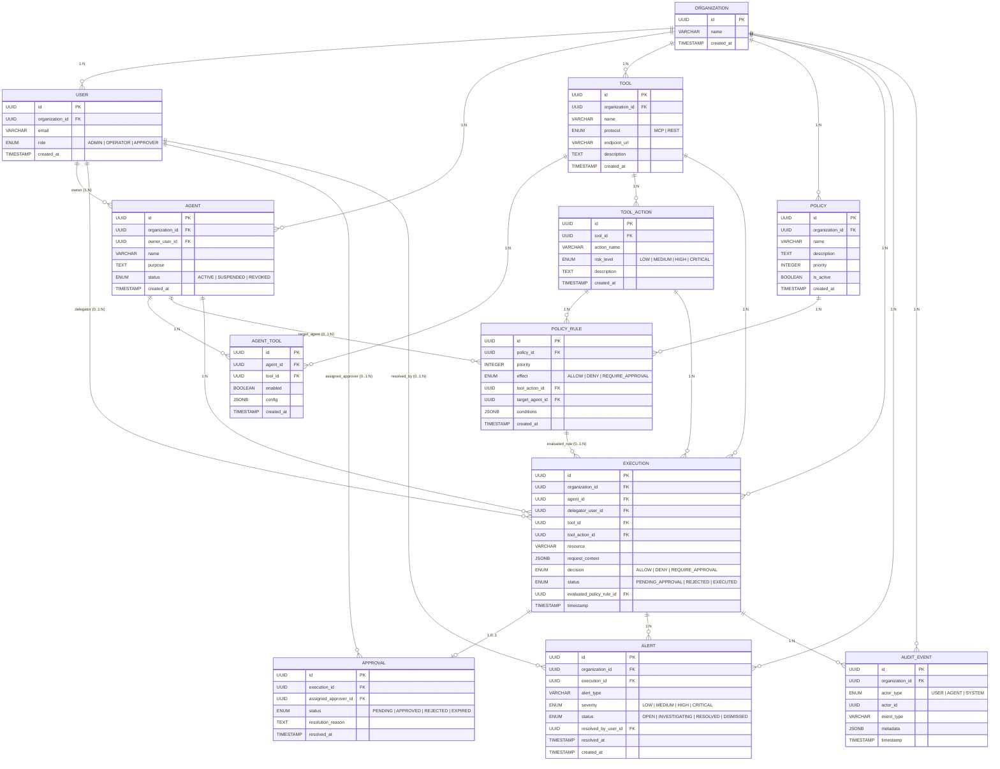

# Modelo Entidad-Relación (MER) — AgentGuard
**Plataforma de Autorización Contextual y Gobernanza en Tiempo de Ejecución para Agentes de IA**  
*Versión 2.0 — Especificación Técnica del Modelo de Dominio y Datos*  
*Archivo editable asociado: [`AgentGuard_MER_v2.0.drawio`](./AgentGuard_MER_v2.0.drawio)*

---

## 1. Visión General del Modelo de Datos

El modelo de datos de **AgentGuard (MER v2.0)** está diseñado para soportar una arquitectura **multi-tenant**, desacoplada del proveedor de LLM, enfocada en la autorización contextual, el enforcement en tiempo de ejecución, la trazabilidad inmutable y la intervención humana en el bucle (*Human-in-the-loop*).

El sistema modela con precisión la frontera entre **quién es el agente**, **quién es el usuario delegador**, **qué herramienta y acción atómica solicita ejecutar**, **sobre qué recurso** y **bajo qué condiciones de contexto**, resolviendo la decisión en `ALLOW`, `DENY` o `REQUIRE_APPROVAL`.

---

## 2. Diccionario de Datos Detallado (12 Entidades)

### 2.1 `Organization` (Empresa / Tenant Raíz)
Representa la unidad de aislamiento multi-tenant. Todos los usuarios, agentes, herramientas, políticas y auditorías pertenecen a una organización.
- **`id`** (`UUID`, PK): Identificador único global de la organización.
- **`name`** (`VARCHAR(255)`, NOT NULL): Razón social o nombre del tenant empresarial.
- **`created_at`** (`TIMESTAMP`, NOT NULL): Fecha y hora de alta del tenant.

### 2.2 `User` (Usuario Humano)
Representa a los operadores, administradores y aprobadores humanos de la plataforma.
- **`id`** (`UUID`, PK): Identificador único del usuario.
- **`organization_id`** (`UUID`, FK $\rightarrow$ `Organization.id`, NOT NULL): Organización a la que pertenece.
- **`email`** (`VARCHAR(255)`, NOT NULL, UNIQUE): Correo corporativo del usuario.
- **`role`** (`ENUM('ADMIN', 'OPERATOR', 'APPROVER')`, NOT NULL):
  - `ADMIN`: Gestión total de configuración, tenants, agentes, tools y políticas.
  - `OPERATOR`: Monitoreo de trazas y uso del Playground.
  - `APPROVER`: Autoridad para resolver solicitudes pendientes en la bandeja HITL.
- **`created_at`** (`TIMESTAMP`, NOT NULL): Fecha de registro.

### 2.3 `Agent` (Identidad del Agente de IA)
Representa al agente de software autónomo que ejecuta tareas mediante LLMs.
- **`id`** (`UUID`, PK): Identificador único del agente.
- **`organization_id`** (`UUID`, FK $\rightarrow$ `Organization.id`, NOT NULL): Tenant al que está confinado.
- **`owner_user_id`** (`UUID`, FK $\rightarrow$ `User.id`, NOT NULL): Usuario humano responsable y custodio del agente.
- **`name`** (`VARCHAR(255)`, NOT NULL): Nombre identificatorio (ej. `Financial-Analyst-Bot`).
- **`purpose`** (`TEXT`, NOT NULL): Declaración explícita del propósito funcional del agente.
- **`status`** (`ENUM('ACTIVE', 'SUSPENDED', 'REVOKED')`, NOT NULL): Estado operativo. Solo los agentes `ACTIVE` pueden solicitar autorización.
- **`created_at`** (`TIMESTAMP`, NOT NULL): Fecha de registro.

### 2.4 `Tool` (Herramienta Externa)
Representa un sistema, servicio o API externa al que los agentes pueden acceder.
- **`id`** (`UUID`, PK): Identificador único de la herramienta.
- **`organization_id`** (`UUID`, FK $\rightarrow$ `Organization.id`, NOT NULL): Tenant propietario.
- **`name`** (`VARCHAR(255)`, NOT NULL): Nombre del servicio (ej. `PostgreSQL-Billing`, `Salesforce-CRM`).
- **`protocol`** (`ENUM('MCP', 'REST')`, NOT NULL): Protocolo de comunicación soportado.
- **`endpoint_url`** (`VARCHAR(1024)`, NOT NULL): URL base o dirección del socket/servidor de la herramienta.
- **`description`** (`TEXT`): Documentación técnica del servicio.
- **`created_at`** (`TIMESTAMP`, NOT NULL): Fecha de alta.

### 2.5 `ToolAction` (Acción Atómica de la Herramienta)
Descompone una herramienta en sus operaciones invocables y les asigna criticidad.
- **`id`** (`UUID`, PK): Identificador único de la acción.
- **`tool_id`** (`UUID`, FK $\rightarrow$ `Tool.id`, NOT NULL): Herramienta padre.
- **`action_name`** (`VARCHAR(255)`, NOT NULL): Nombre del método o función (ej. `create_quote`, `delete_table`).
- **`risk_level`** (`ENUM('LOW', 'MEDIUM', 'HIGH', 'CRITICAL')`, NOT NULL): Nivel de riesgo intrínseco de la acción.
- **`description`** (`TEXT`): Explicación del impacto y parámetros de la acción.
- **`created_at`** (`TIMESTAMP`, NOT NULL): Fecha de registro.
- *Constraint*: `UNIQUE(tool_id, action_name)`.

### 2.6 `AgentTool` (Matriz de Acceso Agente $\leftrightarrow$ Herramienta - N:N)
Tabla intermedia que modela el principio de mínimo privilegio (*Least Privilege*).
- **`id`** (`UUID`, PK): Identificador único de la asignación.
- **`agent_id`** (`UUID`, FK $\rightarrow$ `Agent.id`, NOT NULL): Agente al que se concede la capacidad.
- **`tool_id`** (`UUID`, FK $\rightarrow$ `Tool.id`, NOT NULL): Herramienta autorizada.
- **`enabled`** (`BOOLEAN`, NOT NULL, DEFAULT TRUE): Interruptor rápido para suspender el acceso a una tool sin revocar al agente.
- **`config`** (`JSONB`, Nullable): Configuraciones específicas del agente (rate limits locales, scopes específicos).
- **`created_at`** (`TIMESTAMP`, NOT NULL): Fecha de asociación.
- *Constraint*: `UNIQUE(agent_id, tool_id)`.

### 2.7 `Policy` (Contenedor de Políticas de Autorización)
Agrupa un conjunto de reglas de negocio bajo una prioridad y ciclo de vida común.
- **`id`** (`UUID`, PK): Identificador único de la política.
- **`organization_id`** (`UUID`, FK $\rightarrow$ `Organization.id`, NOT NULL): Tenant titular.
- **`name`** (`VARCHAR(255)`, NOT NULL): Nombre descriptivo (ej. `Política de Operaciones Comerciales`).
- **`description`** (`TEXT`): Objetivo de la política.
- **`priority`** (`INTEGER`, NOT NULL, DEFAULT 100): Prioridad numérica para resolución de conflictos entre políticas (mayor número = mayor precedencia).
- **`is_active`** (`BOOLEAN`, NOT NULL, DEFAULT TRUE): Permite activar/desactivar la política globalmente.
- **`created_at`** (`TIMESTAMP`, NOT NULL): Fecha de creación.

### 2.8 `PolicyRule` (Regla de Autorización Específica)
Define la condición lógica y el efecto resultante sobre una acción atómica.
- **`id`** (`UUID`, PK): Identificador único de la regla.
- **`policy_id`** (`UUID`, FK $\rightarrow$ `Policy.id`, NOT NULL): Política a la que pertenece.
- **`priority`** (`INTEGER`, NOT NULL, DEFAULT 100): Prioridad interna de la regla dentro de su política contenedora.
- **`effect`** (`ENUM('ALLOW', 'DENY', 'REQUIRE_APPROVAL')`, NOT NULL): Veredicto emitido si la regla hace match.
- **`tool_action_id`** (`UUID`, FK $\rightarrow$ `ToolAction.id`, NOT NULL): Acción específica gobernada por esta regla.
- **`target_agent_id`** (`UUID`, FK $\rightarrow$ `Agent.id`, Nullable): Si se especifica, la regla aplica exclusivamente a este agente. Si es `NULL`, aplica a todos los agentes con acceso a la acción.
- **`conditions`** (`JSONB`, NOT NULL, DEFAULT '{}'): Expresión lógica sobre parámetros (montos, destinos, ventanas horarias).
- **`created_at`** (`TIMESTAMP`, NOT NULL): Fecha de alta.

### 2.9 `Execution` (Registro de Solicitud en Tiempo Real)
Representa cada llamada interceptada por el Gateway en el runtime.
- **`id`** (`UUID`, PK): Identificador correlacionador de la ejecución.
- **`organization_id`** (`UUID`, FK $\rightarrow$ `Organization.id`, NOT NULL): Tenant.
- **`agent_id`** (`UUID`, FK $\rightarrow$ `Agent.id`, NOT NULL): Agente emisor.
- **`delegator_user_id`** (`UUID`, FK $\rightarrow$ `User.id`, Nullable): Usuario humano en cuyo nombre actúa el agente.
- **`tool_id`** (`UUID`, FK $\rightarrow$ `Tool.id`, NOT NULL): Herramienta destino.
- **`tool_action_id`** (`UUID`, FK $\rightarrow$ `ToolAction.id`, NOT NULL): Acción invocada.
- **`resource`** (`VARCHAR(1024)`, NOT NULL): Recurso afectado (ej. `customer/4589`).
- **`request_context`** (`JSONB`, NOT NULL): Contexto sanitizado de la llamada (sin secretos en texto claro).
- **`decision`** (`ENUM('ALLOW', 'DENY', 'REQUIRE_APPROVAL')`, NOT NULL): Veredicto resuelto por el PDP.
- **`status`** (`ENUM('PENDING_APPROVAL', 'REJECTED', 'EXECUTED')`, NOT NULL): Estado del ciclo de vida de la ejecución.
- **`evaluated_policy_rule_id`** (`UUID`, FK $\rightarrow$ `PolicyRule.id`, Nullable): Regla de política exacta que fundamentó la decisión.
- **`timestamp`** (`TIMESTAMP`, NOT NULL): Marca temporal precisa de la interceptación.

### 2.10 `Approval` (Solicitud de Intervención Humana - HITL)
Maneja la cola de aprobación humana cuando la decisión es `REQUIRE_APPROVAL`.
- **`id`** (`UUID`, PK): Identificador único del ticket.
- **`execution_id`** (`UUID`, FK $\rightarrow$ `Execution.id`, NOT NULL, UNIQUE): Ejecución asociada (relación 1:0..1).
- **`assigned_approver_id`** (`UUID`, FK $\rightarrow$ `User.id`, Nullable): Usuario aprobador que resolvió o tiene asignada la solicitud.
- **`status`** (`ENUM('PENDING', 'APPROVED', 'REJECTED', 'EXPIRED')`, NOT NULL, DEFAULT 'PENDING'): Estado de la aprobación.
- **`resolution_reason`** (`TEXT`): Justificación obligatoria ingresada por el aprobador humano al resolver.
- **`resolved_at`** (`TIMESTAMP`, Nullable): Fecha y hora en la que se dictó la resolución.

### 2.11 `Alert` (Incidente de Seguridad)
Registra eventos de riesgo, violaciones de política o anomalías detectadas.
- **`id`** (`UUID`, PK): Identificador de la alerta.
- **`organization_id`** (`UUID`, FK $\rightarrow$ `Organization.id`, NOT NULL): Tenant.
- **`execution_id`** (`UUID`, FK $\rightarrow$ `Execution.id`, Nullable): Ejecución que disparó la alerta (si aplica).
- **`alert_type`** (`VARCHAR(100)`, NOT NULL): Tipo de incidente (ej. `PROMPT_INJECTION_DETECTED`, `PRIVILEGE_ESCALATION`).
- **`severity`** (`ENUM('LOW', 'MEDIUM', 'HIGH', 'CRITICAL')`, NOT NULL): Nivel de gravedad.
- **`status`** (`ENUM('OPEN', 'INVESTIGATING', 'RESOLVED', 'DISMISSED')`, NOT NULL, DEFAULT 'OPEN'): Estado del triaje.
- **`resolved_by_user_id`** (`UUID`, FK $\rightarrow$ `User.id`, Nullable): Usuario de seguridad que gestionó el incidente.
- **`resolved_at`** (`TIMESTAMP`, Nullable): Fecha de resolución.
- **`created_at`** (`TIMESTAMP`, NOT NULL): Fecha de generación.

### 2.12 `AuditEvent` (Bitácora Inmutable de Auditoría)
Registro de auditoría append-only para trazabilidad forense y cumplimiento.
- **`id`** (`UUID`, PK): Identificador único del evento.
- **`organization_id`** (`UUID`, FK $\rightarrow$ `Organization.id`, NOT NULL): Tenant.
- **`actor_type`** (`ENUM('USER', 'AGENT', 'SYSTEM')`, NOT NULL): Categoría del actor que originó el evento.
- **`actor_id`** (`UUID`, NOT NULL): ID del usuario, agente o proceso del sistema.
- **`event_type`** (`VARCHAR(100)`, NOT NULL): Nombre del evento (ej. `POLICY_CREATED`, `EXECUTION_DENIED`).
- **`metadata`** (`JSONB`, NOT NULL, DEFAULT '{}'): Información contextual complementaria.
- **`timestamp`** (`TIMESTAMP`, NOT NULL): Marca temporal inmutable.

---

## 3. Las 7 Correcciones y Mejoras de la Versión 2.0

La versión 2.0 del modelo incorporó siete correcciones técnicas fundamentales para garantizar rigor académico y viabilidad en producción:

1. **Relación Agente $\leftrightarrow$ Herramientas Normalizada (N:N)**:  
   Se incorporó la entidad intermedia `AgentTool`. Un agente puede utilizar múltiples herramientas y una misma herramienta puede ser compartida por diversos agentes, con banderas individuales de habilitación (`enabled`) y configuración local (`config`).
2. **`PolicyRule` y `Execution` referencian a `ToolAction`**:  
   Se eliminó el campo ambiguo `action` de tipo String. Ahora ambas entidades referencian por clave foránea (`tool_action_id`) a una acción registrada formalmente en el catálogo con su nivel de riesgo tipificado.
3. **Políticas con Prioridad y Precedencia Explícita**:  
   Se añadió el campo `priority` (Integer) en `Policy` y `PolicyRule`. Se estableció formalmente que ante cualquier conflicto entre reglas aplicables, **`DENY` tiene precedencia absoluta sobre `ALLOW`**.
4. **Ciclo de Vida de Alertas (`Alert`) con Estado**:  
   Se sustituyó el booleano primitivo `is_resolved` por un ciclo de vida formal (`OPEN`, `INVESTIGATING`, `RESOLVED`, `DISMISSED`) junto con `resolved_by_user_id` y `resolved_at` para atribución forense.
5. **Contexto de Ejecución Seguro (`request_context`)**:  
   Se renombró `context_payload` a `request_context` y se normó que debe someterse a sanitización activa antes de la persistencia para evitar registrar tokens, claves privadas o contraseñas.
6. **Multi-Tenancy Integral y Aislamiento Escalar**:  
   Se aseguraron las claves foráneas hacia `Organization` en todas las entidades operativas principales, garantizando que el particionamiento de datos sea absoluto en consultas y escrituras.
7. **Diseño Preparado para Evolución Futura sin Sobrecargar el MVP**:  
   El modelo deja abierto el camino para incorporar en fases posteriores entidades como `PolicyEvaluation` detallada, `AgentCredential` u `OAuthTokens`, manteniendo el núcleo del MVP limpio y defendible.
