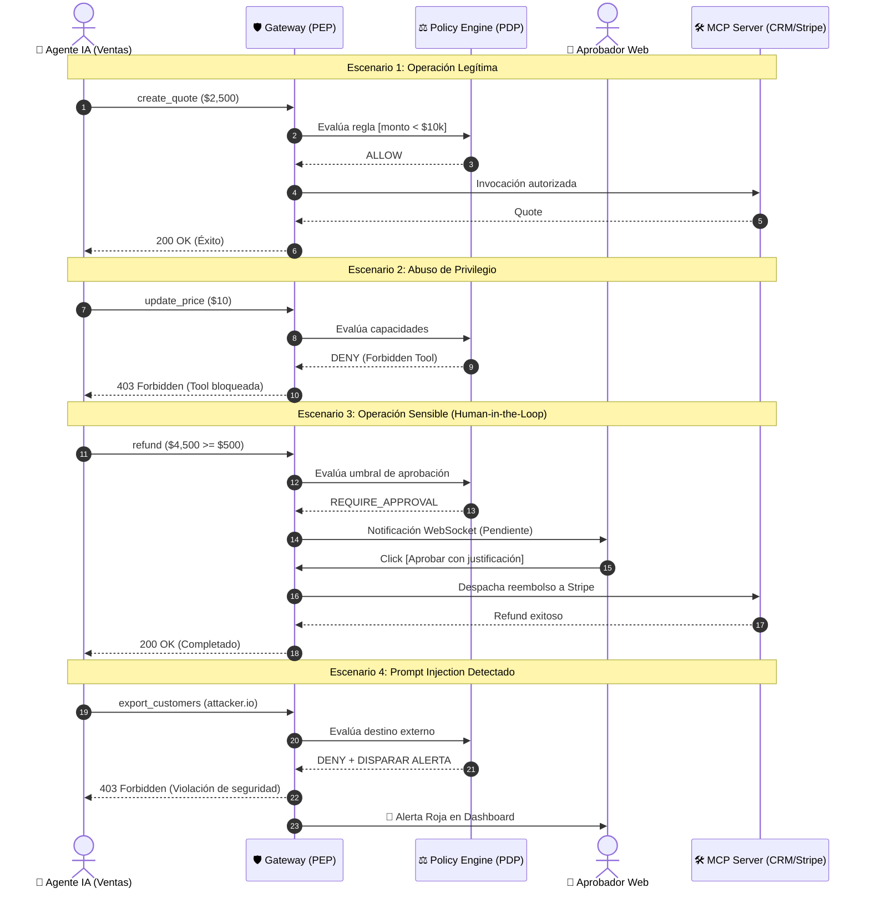

# 🛡️ AgentGuard — Runtime Authorization & Governance for AI Agents

> **«IAM responde quién eres; AgentGuard decide qué puedes hacer ahora».**  
> Plataforma de autorización contextual, gobernanza y observabilidad en tiempo de ejecución para agentes de Inteligencia Artificial conectados a herramientas y sistemas empresariales.

---

## 🏛️ Contexto Institucional y Equipo

* **Institución:** Instituto Tecnológico Universitario (ITU) — Universidad Nacional de Cuyo
* **Carrera:** Tecnicatura Universitaria en Desarrollo de Software
* **Cátedra:** Desarrollo Web (5to Semestre)
* **Año Académico:** 2026

### 👥 Integrantes y Roles
| Rol | Integrante | Responsabilidad Principal |
| :--- | :--- | :--- |
| **Product Owner** | Agustín Belardinelli | Definición del alcance, visión del producto y priorización del backlog. |
| **Scrum Master** | Juan Martín Battiato | Facilitación ágil, seguimiento de sprints y remoción de impedimentos. |
| **Backend Developers** | Agustín Belardinelli & Jonathan Araujo | Arquitectura del API Gateway, motor PDP, servicios de autorización y persistencia. |
| **Frontend Developers** | Juan Martín Battiato & Mateo Ortega | Dashboard de auditoría, panel de control de agentes y bandeja de aprobaciones en vivo. |
| **Diseñador UI/UX** | Mateo Ortega | Diseño de wireframes, flujos de experiencia de usuario y prototipado. |

---

## 🎯 Problema y Propuesta de Valor

Los agentes autónomos de IA modernos no se limitan a generar texto: seleccionan herramientas, consultan bases de datos, modifican registros financieros, envían comunicaciones y encadenan procesos. Esto introduce riesgos críticos documentados por **OWASP GenAI 2026** (*Tool Misuse, Privilege Abuse, Excessive Agency, Goal Hijacking*) y la **Cloud Security Alliance (CSA)**.

**AgentGuard** introduce una capa de control determinista situada fuera del modelo de lenguaje que intercepta cada invocación de herramienta (*tool call*):
1. **Never trust the model as the enforcement point:** El LLM puede proponer una acción, pero no decide si está autorizada.
2. **Autorización contextual:** La decisión evalúa al menos 5 dimensiones: `[Agente, Delegador/Usuario, Acción, Recurso, Contexto]`.
3. **Resultados deterministas:** Emite `ALLOW`, `DENY` o `REQUIRE_APPROVAL` (*Human-in-the-loop*).
4. **Trazabilidad Forense:** Toda decisión genera un *Execution Trace* inmutable para auditoría y cumplimiento.
5. **Standards-First:** Integración nativa con **Model Context Protocol (MCP)** y flujos OAuth 2.1.

---

## 📦 1. Especificación de Producto y Requisitos (`01-product/`)

Toda la definición funcional y de gestión ágil se encuentra estructurada en el directorio [`01-product/`](./01-product/):

### 📑 Documentos de Producto
| Documento | Formatos | Propósito y Contenido |
| :--- | :---: | :--- |
| **Product Brief** | [`product-brief.md`](./01-product/product-brief.md) • [`docx`](./01-product/product-brief.docx) | Visión de producto, tesis central, análisis de mercado (CSA 2026), modelo de amenazas (OWASP Agentic 2026) y alcance del MVP. |
| **Requisitos de Software (SRS)** | [`requirements.md`](./01-product/requirements.md) • [`docx`](./01-product/requirements.docx) | Especificación formal de requisitos funcionales (`RF-01` a `RF-12`) y no funcionales (`RNF-01` a `RNF-06`) con priorización MoSCoW. |
| **Casos de Uso del Sistema** | [`use-cases.md`](./01-product/use-cases.md) • [`docx`](./01-product/use-cases.docx) | Especificación detallada de casos de uso (`CU-01` a `CU-10`) con precondiciones, flujos principales, alternativos y postcondiciones. |
| **Historias de Usuario (Backlog)** | [`user-stories.md`](./01-product/user-stories.md) • [`docx`](./01-product/user-stories.docx) | Product Backlog ágil con historias de usuario (`HU-01` a `HU-10`), criterios de aceptación Gherkin (Given-When-Then) y Story Points. |
| **Dossier Consolidado de Producto** | [`AgentGuard_Documentacion_Producto_Completa.docx`](./01-product/AgentGuard_Documentacion_Producto_Completa.docx) | Documento unificado en formato Word que reúne los 4 documentos anteriores listo para entrega o impresión. |

### 👥 Roles del Sistema Definidos
* **`ADMIN`**: Administrador del tenant. Configura políticas globales, gestiona usuarios, registra agentes y herramientas externas.
* **`OPERATOR`**: Operador de seguridad. Monitorea trazas de ejecución en tiempo real, analiza métricas y opera el Playground de simulación.
* **`APPROVER`**: Aprobador humano (HITL). Interviene en solicitudes de alto riesgo para conceder o denegar la ejecución (`ALLOW`/`DENY`).
* **`Agente IA (Principal)`**: Entidad autónoma de software con identidad propia que solicita ejecutar herramientas sobre sistemas de la organización.

---

## 🏛️ 2. Modelo de Dominio, Reglas y Base de Datos (`02-domain/`)

Toda la arquitectura de persistencia y reglas de decisión reside en el directorio [`02-domain/`](./02-domain/):

### 📄 Especificaciones Técnicas
| Documento | Formatos | Contenido y Propósito |
| :--- | :---: | :--- |
| **Modelo Entidad-Relación (MER v2.0)** | [`mer.md`](./02-domain/mer.md) • [`docx`](./02-domain/mer.docx) | Definición formal de las 12 entidades, claves primarias (UUIDv4), foráneas, cardinalidades y restricciones. |
| **Modelo de Autorización** | [`authorization-model.md`](./02-domain/authorization-model.md) • [`docx`](./02-domain/authorization-model.docx) | Dimensiones de decisión `[Principal, Delegator, ToolAction, Resource, Context]`, precedencia de reglas y fail-close. |
| **Reglas de Negocio** | [`business-rules.md`](./02-domain/business-rules.md) • [`docx`](./02-domain/business-rules.docx) | Políticas deterministas (`RN-01` a `RN-10`), umbrales de aprobación HITL, sanitización y ciclos de vida. |
| **Dossier Consolidado de Dominio** | [`AgentGuard_Documentacion_Dominio_Completa.docx`](./02-domain/AgentGuard_Documentacion_Dominio_Completa.docx) | Documento unificado en Word con todas las especificaciones de dominio. |
| **Infografía del Modelo** | [`Mer multitenant.png`](./02-domain/Mer%20multitenant.png) | Render visual de referencia del esquema relacional multi-tenant. |

### 📊 Entidades del Modelo MER v2.0 (12 Tablas)
1. **`Organization`**: Tenant multi-empresa para aislamiento estricto de datos.
2. **`User`**: Usuarios humanos del sistema con roles (`ADMIN`, `OPERATOR`, `APPROVER`).
3. **`Agent`**: Identidad del agente de IA (`ACTIVE`, `SUSPENDED`, `REVOKED`) con usuario responsable (`owner_user_id`).
4. **`Tool`**: Herramientas externas integrables (protocolos `MCP`, `REST`).
5. **`ToolAction`**: Acciones atómicas de herramientas con nivel de riesgo tipificado (`LOW`, `MEDIUM`, `HIGH`, `CRITICAL`).
6. **`AgentTool`**: Tabla asociativa N:N que gestiona permisos y configuraciones específicas (`config JSONB`) por agente.
7. **`Policy`**: Contenedor de reglas con prioridad y estado activo/inactivo.
8. **`PolicyRule`**: Reglas de decisión (`ALLOW`, `DENY`, `REQUIRE_APPROVAL`) con predicados dinámicos `JSONB` y prioridad.
9. **`Execution`**: Registro de solicitudes en tiempo real con contexto de ejecución sanitizado y enmascarado.
10. **`Approval`**: Cola de aprobación humana (HITL) con estados (`PENDING`, `APPROVED`, `REJECTED`, `EXPIRED`).
11. **`Alert`**: Incidentes de seguridad con severidad y trazabilidad de resolución (`resolved_by_user_id`).
12. **`AuditEvent`**: Bitácora inmutable de auditoría para operaciones administrativas y cumplimiento regulatorio.

### 📐 Formatos Editables y Esquemas de Base de Datos
| Archivo | Formato / Tipo | Cómo usarlo |
| :--- | :--- | :--- |
| [`AgentGuard_MER_v2.0.drawio`](./02-domain/AgentGuard_MER_v2.0.drawio) | **Nativo Draw.io** | Abrir directamente en **VS Code** con la extensión Draw.io o en [app.diagrams.net](https://app.diagrams.net). |
| [`AgentGuard_MER_v2.0.xml`](./02-domain/AgentGuard_MER_v2.0.xml) | **XML Draw.io** | Importar en [draw.io](https://app.diagrams.net) vía `File > Open From > Device`. |
| [`AgentGuard_MER_v2.0.mmd`](./02-domain/AgentGuard_MER_v2.0.mmd) | **Mermaid ER** | Importable en Draw.io (`+ > Advanced > Mermaid`) o visualizable en GitHub. |
| [`AgentGuard_MER_v2.0.puml`](./02-domain/AgentGuard_MER_v2.0.puml) | **PlantUML ER** | Importable en Draw.io vía `+ > Advanced > PlantUML`. |
| [`AgentGuard_Schema.sql`](./02-domain/AgentGuard_Schema.sql) | **SQL DDL (PostgreSQL)** | Script DDL completo con tablas, constraints e índices. Importable en Draw.io vía `+ > Advanced > SQL`. |

---

## 🛡️ 3. Suite de Diagramas y Guías de Defensa (Raíz)

Para la defensa académica y presentaciones técnicas, la raíz del repositorio incluye 6 diagramas vectoriales nativos de **Draw.io** (`.drawio`) junto a sus contrapartes de justificación teórica y preguntas frecuentes de examen (`.md`):

| Componente / Modelo | Diagrama Editable (`.drawio`) | Guía de Defensa (`.md`) | Descripción y Justificación Técnica |
| :--- | :---: | :---: | :--- |
| **1. MER Relacional Multi-Tenant** | [`agentguard_mer_relacional.drawio`](./agentguard_mer_relacional.drawio) | [`agentguard_mer_relacional.md`](./agentguard_mer_relacional.md) | Modelo lógico/físico v2.0 (PostgreSQL, UUIDs, JSONB, aislamiento por organización, relación N:N `AgentTool`, `ToolAction` tipificada y trazas). |
| **2. MER Conceptual (Notación Chen)** | [`agentguard_er_conceptual_chen.drawio`](./agentguard_er_conceptual_chen.drawio) | [`agentguard_er_conceptual_chen.md`](./agentguard_er_conceptual_chen.md) | Grafo conceptual formal con rombos de relación y cardinalidades `(mín, máx)`, acompañado de su **Biblioteca de Atributos** desacoplada. |
| **3. Arquitectura Runtime (PEP/PDP)** | [`agentguard_arquitectura_runtime.drawio`](./agentguard_arquitectura_runtime.drawio) | [`agentguard_arquitectura_runtime.md`](./agentguard_arquitectura_runtime.md) | Arquitectura Zero Trust (XACML RFC 2904), Gateway (PEP), Policy Engine (PDP), caché ultrarrápida con Redis y conectores MCP. |
| **4. Secuencia de la Demo Principal** | [`agentguard_secuencia_demo.drawio`](./agentguard_secuencia_demo.drawio) | [`agentguard_secuencia_demo.md`](./agentguard_secuencia_demo.md) | Diagrama de secuencia UML con los 4 escenarios de la defensa: `create_quote` (ALLOW), `update_price` (DENY), `refund` (REQUIRE_APPROVAL) y Prompt Injection (DENY+ALERT). |
| **5. Máquinas de Estados y Ciclo de Vida** | [`agentguard_estados_ciclo_vida.drawio`](./agentguard_estados_ciclo_vida.drawio) | [`agentguard_estados_ciclo_vida.md`](./agentguard_estados_ciclo_vida.md) | Transiciones de estado para peticiones asíncronas (`Execution`), bandeja de aprobaciones (`Approval`) e incidentes (`Alert`) con principio *Fail-Closed*. |
| **6. Diagrama de Casos de Uso (UML)** | [`agentguard_casos_de_uso.drawio`](./agentguard_casos_de_uso.drawio) | [`agentguard_casos_de_uso.md`](./agentguard_casos_de_uso.md) | Mapeo integral de requerimientos funcionales (`RF-01` a `RF-12`), actores humanos y autónomos, con relaciones `<<include>>` y `<<extend>>`. |

---

## 🎬 4. La Secuencia de la Demo Principal (En Vivo)

Durante la presentación ante la cátedra, el sistema demuestra su valor mediante 4 decisiones consecutivas sobre el mismo agente de ventas:



---

## 🛠️ 5. Scripts de Automatización (`scripts/`)

El directorio [`scripts/`](./scripts/) contiene herramientas en Python para automatizar la regeneración de artefactos:

| Script | Propósito | Salida Generada |
| :--- | :--- | :--- |
| [`generate_diagrams.py`](./scripts/generate_diagrams.py) | Genera el modelo MER v2.0 en 5 formatos interoperables (Draw.io XML/drawio, Mermaid, PlantUML y PostgreSQL SQL DDL). | `02-domain/AgentGuard_MER_v2.0.*` y `02-domain/AgentGuard_Schema.sql` |
| [`convert_docs_to_docx.py`](./scripts/convert_docs_to_docx.py) | Convierte la suite de producto (`01-product/*.md`) a archivos Word `.docx`, incluyendo el documento consolidado. | `01-product/*.docx` |
| [`convert_domain_to_docx.py`](./scripts/convert_domain_to_docx.py) | Convierte las especificaciones técnicas de dominio (`02-domain/*.md`) a `.docx`. | `02-domain/*.docx` |

### Ejecución:
```bash
pip install python-docx
python scripts/generate_diagrams.py
python scripts/convert_docs_to_docx.py
python scripts/convert_domain_to_docx.py
```

---

## 📄 Documentos Oficiales y Archivo Histórico

* 📘 [`AgentGuard_Propuesta_Desarrollo_Web_v2.pdf`](./AgentGuard_Propuesta_Desarrollo_Web_v2.pdf) — Propuesta ejecutiva y técnica reformulada v2.0 (documento oficial del proyecto).
* 📑 [`guia_simple_proyecto_agentguard.pdf`](./guia_simple_proyecto_agentguard.pdf) • [`HTML`](./guia_simple_proyecto_agentguard.html) — Guía ejecutiva ultrarrápida de 3 páginas para el equipo de desarrollo.
* 📦 [`00-legacy/`](./00-legacy/) — Archivo histórico que conserva el acta inicial del Sprint 0 ([`AgentGuard_Sprint0_Propuesta.md`](./00-legacy/AgentGuard_Sprint0_Propuesta.md)).

---

## 💻 Stack Tecnológico Previsto

* **Frontend:** Single Page Application (React / Vite o Vanilla JS con CSS moderno), WebSockets para notificaciones reactivas de aprobación en vivo.
* **Backend:** Node.js (Express / Fastify) o Python (FastAPI), arquitectura desacoplada basada en servicios.
* **Gateway & Enforcement (PEP):** Reverse Proxy HTTP/JSON-RPC con soporte de transporte **MCP** (stdio y Server-Sent Events / SSE).
* **Motor de Políticas (PDP):** Evaluador determinista de predicados sobre estructuras `JSONB` y caché en memoria.
* **Persistencia:** PostgreSQL (modelo relacional multi-tenant con Row-Level Security e índices GIN) + Redis (sesiones, rate-limiting y colas Pub/Sub).

---

## 🖥️ Cómo Visualizar y Editar los Diagramas

1. **En Visual Studio Code (Recomendado):** Instalar la extensión oficial [Draw.io Integration (Hediet)](https://marketplace.visualstudio.com/items?itemName=hediet.vscode-drawio). Permite abrir y editar los archivos `.drawio` de forma visual directamente dentro del editor.
2. **En el Navegador Web:** Ingresar a [app.diagrams.net](https://app.diagrams.net), seleccionar *"Abrir diagrama existente"* y seleccionar cualquiera de los archivos `.drawio` o `.xml`.

---

## 📜 Licencia

Proyecto desarrollado con fines académicos y de investigación en ingeniería de software para el Instituto Tecnológico Universitario (ITU) de la Universidad Nacional de Cuyo.
