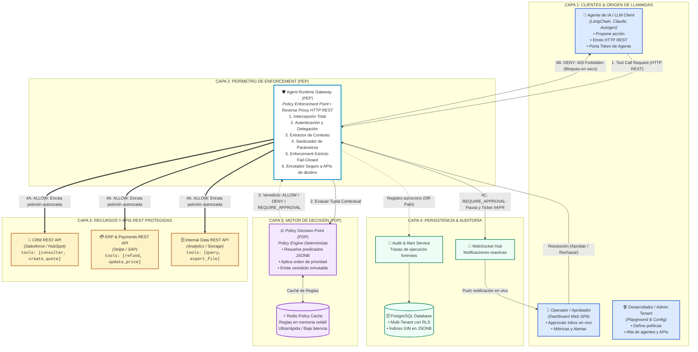

# 🏗️ Guía de Defensa: Arquitectura de Runtime y Flujo de Intercepción PEP / PDP
**Archivo visual opcional (Draw.io):** [`diagramas/agentguard_arquitectura_runtime.drawio`](./diagramas/agentguard_arquitectura_runtime.drawio)  
**Proyecto:** AgentGuard — Runtime Authorization & Governance for AI Agents  
**Cátedra:** Desarrollo Web — 5to Semestre, ITU - Universidad Nacional de Cuyo  

---

## 1. El Paradigma de Seguridad: ¿Por qué Fuera del LLM?

El axioma de seguridad más importante de AgentGuard es:
> **«Never trust the model as the enforcement point» (Nunca confíes en el LLM como punto de control).**

* **Fundamento:** Los modelos de lenguaje grandes (LLMs) son probabilísticos y vulnerables a ataques de manipulación semántica (*Prompt Injection, Jailbreaking, Goal Hijacking* descritos en OWASP GenAI 2026).
* Si le pedimos al propio agente: *"Oye, ¿tienes permiso para borrar esta base de datos?"*, un atacante puede instruirlo mediante un prompt envenenado para responder *"Sí, tengo autorización de emergencia"*.
* **La Solución AgentGuard:** La frontera de seguridad se sitúa **completamente fuera del modelo**. El LLM puede proponer cualquier tool call que desee; es el **Agent Runtime Gateway** quien intercepta la llamada físicamente y el **Policy Decision Point (PDP)** quien determina de forma determinista y matemática si la acción se ejecuta, se bloquea o se congela para revisión humana.

---

## 2. Diagrama de Arquitectura de Runtime y Flujo de Intercepción (Mermaid)

---

## 3. Los Dos Componentes Clave: PEP y PDP (Estándar XACML / RFC 2904)

En la literatura de seguridad de redes y autorización de grano fino (RFC 2904 y estándares XACML/ABAC), la arquitectura separa expresamente:

1. **Policy Enforcement Point (PEP) — El "Guardián":**
   * Es el **Agent Runtime Gateway**.
   * Opera como un *Reverse Proxy HTTP REST* que intercepta llamadas atómicas de herramientas.
   * Extrae las credenciales del agente, sanitiza los parámetros JSON y no permite que un solo byte llegue a la API externa protegida sin el aval explícito del PDP.
2. **Policy Decision Point (PDP) — El "Juez":**
   * Es el **Policy Engine**.
   * Recibe la tupla contextual de 5 dimensiones:
     $$\text{Decisión} = f(\text{Principal}, \text{Delegator}, \text{Action}, \text{Resource}, \text{Context})$$
   * Resuelve los predicados lógicos y emite un veredicto inmutable: `ALLOW`, `DENY` o `REQUIRE_APPROVAL`.

---

## 4. Manejo de Latencia y Rendimiento en la Ruta Crítica

Una objeción recurrente de los profesores en materias web es: *"Poner un proxy en el medio va a ralentizar todas las llamadas de la IA"*. 

Nuestra respuesta técnica se sustenta en tres mecanismos:
1. **Caché en Memoria con Redis:** Las políticas activas de cada organización se cachean en memoria volátil de alta velocidad. El PDP evalúa estructuras JSONB en memoria sin golpear el disco de PostgreSQL en cada petición.
2. **Trazabilidad Asíncrona (Off-Path Logging):** El registro del `Execution Trace` en PostgreSQL y la emisión de eventos de auditoría se realizan de forma desacoplada y asíncrona mediante colas de eventos en background (*Worker/Audit Service*). El agente no espera a que la base de datos escriba la fila para recibir su respuesta.
3. **Fail-Closed por Defecto:** Si el gateway sufre un error interno o un timeout de red evaluando una regla, la petición se **rechaza por defecto (`DENY`)**, impidiendo accesos espurios ante fallos.

---

## 5. Preguntas Difíciles del Profesor y Respuestas Magistrales

### ❓ P1: *"¿Por qué dicen que esto no es simplemente un API Gateway como Kong o Nginx?"*
> **Respuesta:** «Un API Gateway tradicional (Kong, Nginx, AWS API Gateway) realiza enrutamiento perimetral, rate-limiting por IP y validación de tokens estáticos (JWT de usuario).  
> AgentGuard va mucho más allá:  
> 1. Modela el dominio específico de **sistemas autónomos de IA**, comprendiendo cadenas de delegación (*Usuario $\rightarrow$ Agente $\rightarrow$ Tarea $\rightarrow$ Herramienta*).  
> 2. Implementa **Human-in-the-loop**, suspendiendo la conexión HTTP del cliente y levantando un ticket en tiempo real hacia una bandeja de aprobación humana antes de despachar la acción hacia el servicio destino.  
> 3. Estandariza la autorización sobre **APIs REST universales**, permitiendo proteger cualquier servicio web empresarial sin requerir protocolos complejos o dependencias propietarias».

### ❓ P2: *"¿Dónde está la Inteligencia Artificial si el backend es determinista?"*
> **Respuesta:** «La IA está en el cliente que interactúa con nuestra plataforma: son los agentes autónomos de venta, soporte o finanzas que toman decisiones y proponen acciones. AgentGuard es la **capa de gobernanza y control perimetral** que las empresas necesitan para poder poner esos agentes en producción sin riesgo de demandas legales o fugas de datos. Pretender que el guardia de seguridad también sea una IA no determinista aumentaría la superficie de ataque; la seguridad debe ser determinista, auditable y explicable».

### ❓ P3: *"¿Qué ocurre si el humano nunca responde a una solicitud `REQUIRE_APPROVAL`?"*
> **Respuesta:** «El `Approval Service` cuenta con un cronómetro de expiración (*TTL / Timeout*, por ejemplo 15 minutos). Si no se recibe una resolución en ese plazo, el estado de la aprobación pasa automáticamente a `EXPIRED`, la ejecución se cancela y se retorna un error controlado al agente, garantizando que ninguna acción quede en un limbo perpetuo ni se ejecute sin supervisión efectiva».
