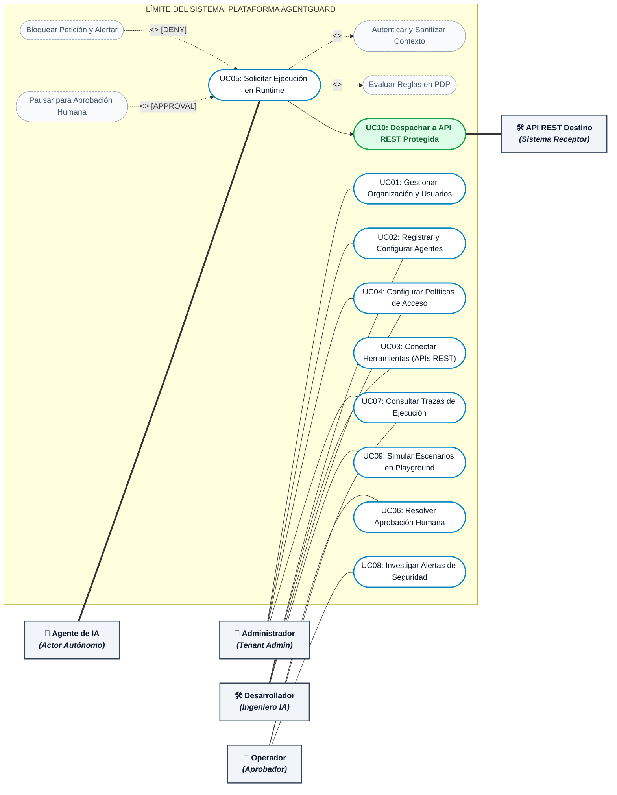

# 🎯 Guía de Defensa: Diagrama de Casos de Uso del Sistema (UML)
**Archivo visual opcional (Draw.io):** [`diagramas/agentguard_casos_de_uso.drawio`](./diagramas/agentguard_casos_de_uso.drawio)  
**Proyecto:** AgentGuard — Runtime Authorization & Governance for AI Agents  
**Cátedra:** Desarrollo Web — 5to Semestre, ITU - Universidad Nacional de Cuyo  

---

## 1. Clasificación de Actores y Frontera del Sistema

En la ingeniería de software moderna, modelar sistemas que interactúan con Inteligencia Artificial requiere distinguir con precisión entre **actores humanos**, **actores autónomos no humanos** y **sistemas externos de destino**:

1. **Actores Humanos Primarios:**
   * **Administrador de Organización (Tenant):** Gestiona la empresa, usuarios, roles y configuración global de auditoría.
   * **Desarrollador / Ingeniero de IA:** Da de alta agentes, enlaza herramientas (APIs REST externas), redacta políticas de autorización y prueba escenarios en el Playground.
   * **Operador / Aprobador:** Supervisa el día a día operativo, atiende la bandeja de aprobaciones pendientes (*Human-in-the-loop*), monitorea métricas e investiga alertas.
2. **Actor Autónomo Primario (No Humano):**
   * **Agente de IA:** Es el consumidor principal del Gateway en tiempo de ejecución. Emite solicitudes (*tool calls*) de forma autónoma.
3. **Actor Secundario Receptor:**
   * **API REST Destino / Tool Externa:** El sistema o servicio web de destino (CRM, Stripe, API interna) que recibe la petición HTTP únicamente cuando AgentGuard la autoriza.

---

## 2. Diagrama de Casos de Uso del Sistema (Mermaid)

---

## 3. Mapeo con los Requisitos Funcionales del Informe (RF-01 a RF-12)

El diagrama de casos de uso cubre rigurosamente los requerimientos funcionales aprobados en la Sección 14 de la propuesta v2.0:

| Caso de Uso | Requisito Funcional Asociado | Descripción Breve |
| :--- | :--- | :--- |
| **UC01: Gestionar Organización y Usuarios** | **RF-01** | Registro de organizaciones (tenants) y gestión de usuarios. |
| **UC02: Registrar y Configurar Agentes** | **RF-02** | Registro de agentes de IA y asignación de owner humano responsable. |
| **UC03: Conectar Herramientas y Acciones** | **RF-03** | Registro de herramientas (APIs REST) y catálogo de endpoints/acciones disponibles. |
| **UC04: Configurar Políticas de Acceso** | **RF-04** | Definición y priorización de reglas deterministas con condiciones JSONB. |
| **UC05: Solicitar Ejecución en Runtime** | **RF-05, RF-06, RF-07** | Intercepción de tool calls, evaluación en PDP y bloqueo/enrutamiento. |
| **UC06: Resolver Aprobación Humana** | **RF-08** | Creación, visualización en Inbox y resolución (Aprobar/Rechazar). |
| **UC07: Consultar Trazas de Ejecución** | **RF-09, RF-10** | Almacenamiento y filtrado de trazas forenses (*Execution Traces*). |
| **UC08: Investigar Alertas de Seguridad** | **RF-11** | Detección de transgresiones (Prompt Injection, desvío de scope) y mitigación. |
| **UC09: Simular Escenarios en Playground**| **RF-12** | Entorno seguro para reproducir peticiones antes de pasarlas a producción. |
| **UC10: Despachar a API REST Protegida** | **RF-05, RF-07** | Reenvío de la orden HTTP validada hacia el endpoint externo homologado. |

---

## 4. Justificación Teórica de Relaciones `<<include>>` y `<<extend>>`

Una de las preguntas favoritas de los profesores de análisis de sistemas es la distinción formal entre inclusiones y extensiones:

### ¿Por qué `Autenticar y Sanitizar Contexto` y `Evaluar Reglas en PDP` son `<<include>>` de UC05?
* **Razón:** Son **pasos obligatorios e incondicionales**. Ninguna solicitud puede saltarse la autenticación ni la evaluación de políticas. La ejecución de UC05 siempre y en todos los casos ejecuta estos dos subprocesos.

### ¿Por qué `Bloquear y Alertar` y `Pausar para Aprobación Humana` son `<<extend>>`?
* **Razón:** Son **comportamientos condicionales y opcionales** que solo se activan bajo puntos de extensión (*extension points*) definidos por el resultado de la evaluación:
  * El bloqueo y disparo de alerta se activa únicamente `[Si Decisión == DENY o riesgo crítico]`.
  * La pausa para intervención humana se activa únicamente `[Si Decisión == REQUIRE_APPROVAL]`.
  * Si la decisión es `ALLOW`, ninguna de estas extensiones se ejecuta y el flujo continúa directamente al despacho de la tool (`UC10: Despachar a API REST`).

---

## 5. Especificación Detallada del Caso de Uso Crítico: UC05

* **Caso de Uso:** UC05 – Solicitar Ejecución de Acción en Runtime.
* **Actor Principal:** Agente de IA.
* **Actores Secundarios:** API REST Destino, Aprobador Humano (en caso de extensión).
* **Precondiciones:**
  1. La organización y el agente están activos (`status = ACTIVE`).
  2. La herramienta y la acción solicitada existen en el catálogo.
* **Flujo Principal (ALLOW):**
  1. El Agente de IA envía una petición de tool call al Agent Runtime Gateway portando sus credenciales.
  2. El Gateway intercepta la petición, valida la autenticidad y extrae el contexto sanitizado (`<<include>>`).
  3. El Gateway invoca al PDP para evaluar la tupla contra las reglas activas de la organización (`<<include>>`).
  4. El PDP determina que la acción está autorizada (`ALLOW`).
  5. El Gateway despacha la petición HTTP a la API REST Destino (`UC10`).
  6. La API REST procesa la petición y devuelve el código de respuesta y payload al Gateway.
  7. El Gateway registra asíncronamente el `Execution Trace` (200 OK) y reenvía el resultado al Agente.
* **Flujos Alternativos / Extensiones:**
  * **Extensión A (DENY):** En el paso 4, el PDP determina que el agente carece de permisos o viola una regla de seguridad. Se ejecuta la extensión `Bloquear Petición`, se registra la traza de rechazo, no se contacta a la API REST destino y se retorna un error `403 Forbidden` al agente. Si la severidad es crítica, se emite una alerta.
  * **Extensión B (REQUIRE_APPROVAL):** En el paso 4, el PDP determina que la operación excede el umbral autónomo. Se ejecuta la extensión `Pausar Solicitud`, se crea un registro de `Approval` en estado `PENDING` y se notifica al operador. El flujo queda a la espera de `UC06`. Si el operador aprueba, se retoma el paso 5; si rechaza o expira el timeout, se aborta la invocación.

---

## 6. Preguntas de Examen / Defensa y Respuestas Clave

### ❓ P1: *"¿Por qué el Agente de IA está modelado como un Actor si no es una persona?"*
> **Respuesta:** «En UML estándar, un Actor se define como cualquier entidad externa al límite del sistema que interactúa con él intercambiando información o consumiendo sus servicios. Dado que los agentes de IA toman decisiones autónomas en tiempo de ejecución y envían peticiones HTTP REST al Gateway en nombre propio o delegados por un usuario, son formalmente actores primarios no humanos de la plataforma».

### ❓ P2: *"¿Por qué la API REST Destino está fuera del límite del sistema a la derecha?"*
> **Respuesta:** «Porque las APIs REST de destino (como Salesforce, Stripe o un servicio interno) son sistemas de terceros o recursos empresariales preexistentes que AgentGuard protege. AgentGuard no es el CRM ni el procesador de pagos; AgentGuard es la frontera de autorización que decide si la llamada HTTP tiene permiso de cruzar el perímetro hacia ellos».
