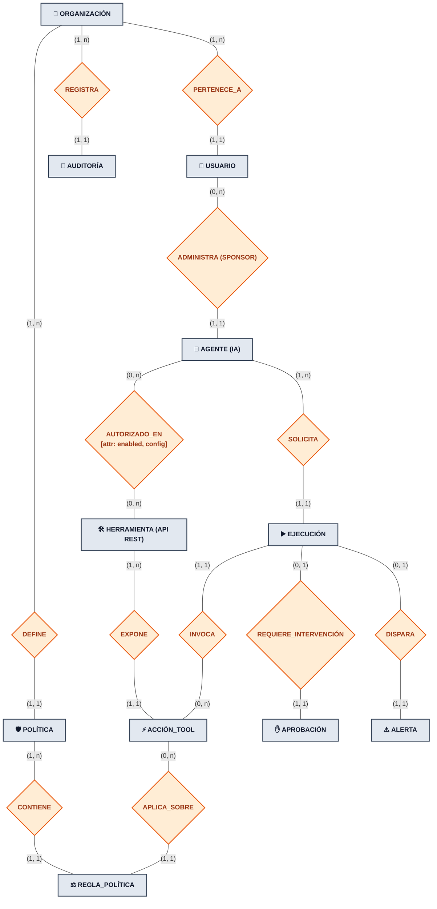

# 📐 Guía de Defensa: Modelo Conceptual (Chen) y Diccionario de Atributos
**Archivo visual opcional (Draw.io):** [`diagramas/agentguard_er_conceptual_chen.drawio`](./diagramas/agentguard_er_conceptual_chen.drawio)  
**Proyecto:** AgentGuard — Runtime Authorization & Governance for AI Agents  
**Cátedra:** Desarrollo Web — 5to Semestre, ITU - Universidad Nacional de Cuyo  

---

## 1. Propósito y Valor Académico de la Notación Chen

En el desarrollo de software y la ingeniería de datos clásica (Peter Chen, 1976), existe una separación indispensable entre:
1. **El Modelo Conceptual:** Captura la semántica pura del negocio, las entidades del mundo real y cómo interactúan entre sí a través de relaciones explícitas (rombos), sin preocuparse todavía por claves foráneas o tipos de almacenamiento físico.
2. **La Biblioteca / Diccionario de Atributos:** Documenta formalmente cada propiedad, su dominio, su obligatoriedad y su función.

> **Argumento ante el docente:**  
> *«Presentar un grafo relacional lleno de columnas técnicas satura visualmente y oculta la semántica del negocio. Separar el diagrama conceptual de Chen de la Biblioteca de Atributos nos permite defender con claridad matemática las cardinalidades y los roles de cada actor antes de entrar al detalle físico de PostgreSQL».*

---

## 2. Diagrama Conceptual de Entidad-Relación (Notación Chen)

---

## 3. Análisis Semántico de las Relaciones y Cardinalidades

A continuación se detalla la justificación formal de las cardinalidades mínimas y máximas expresadas en notación `(mín, máx)`:

### A. Organización y Usuarios: `PERTENECE_A`
* `USUARIO` $\rightarrow$ `(1,1)` $\rightarrow$ Cada usuario humano debe pertenecer obligatoriamente a una y solo una organización (tenant). No existen usuarios "huérfanos".
* `ORGANIZACIÓN` $\rightarrow$ `(1,n)` $\rightarrow$ Una organización no puede existir sin al menos un usuario (el Administrador inicial) y puede tener múltiples operadores o aprobadores.

### B. Usuario y Agente: `ADMINISTRA (OWNER)`
* `AGENTE` $\rightarrow$ `(1,1)` $\rightarrow$ Todo agente autónomo debe tener un humano responsable asignado (*Accountability / AI Governance*). Si un agente comete un error, la organización sabe qué desarrollador o líder técnico es su propietario.
* `USUARIO` $\rightarrow$ `(0,n)` $\rightarrow$ Un usuario puede no haber creado ningún agente todavía, o administrar una flota entera de agentes.

### C. Agente y Herramienta: `AUTORIZADO_EN` (Relación $M:N$)
* `AGENTE` $\rightarrow$ `(0,n)` $\rightarrow$ Un agente recién creado puede no tener herramientas asociadas hasta que se le asignen capacidades.
* `HERRAMIENTA` $\rightarrow$ `(0,n)` $\rightarrow$ Una API REST externa registrada puede estar temporalmente en desuso o ser consumida por decenas de agentes.
* **Atributos de la Relación:** Esta relación alberga atributos propios del vínculo: `enabled (booleano)` para deshabilitar temporalmente una tool para un agente específico, y `config (JSONB)` para guardar configuraciones particulares de invocación.

### D. Herramienta y Acción: `EXPONE`
* `HERRAMIENTA` $\rightarrow$ `(1,n)` $\rightarrow$ Toda herramienta externa debe exponer al menos una acción ejecutable (ej. `create_quote`, `search_db`).
* `ACCIÓN_TOOL` $\rightarrow$ `(1,1)` $\rightarrow$ Una acción concreta no tiene sentido por sí sola; pertenece estrictamente a la herramienta que la implementa.

### E. Ejecución en Runtime: `SOLICITA` e `INVOCA`
* `AGENTE` $\rightarrow$ `(1,n)` $\rightarrow$ El propósito operativo del agente es emitir solicitudes de ejecución a lo largo del tiempo.
* `EJECUCIÓN` $\rightarrow$ `(1,1)` $\rightarrow$ Cada intento de ejecución pertenece indefectiblemente a un único agente emisor.
* `EJECUCIÓN` $\rightarrow$ `(1,1)` `ACCIÓN_TOOL` $\rightarrow$ Cada petición al gateway tiene como objetivo ejecutar una acción específica.

### F. Aprobación Humana: `REQUIERE_INTERVENCIÓN`
* `EJECUCIÓN` $\rightarrow$ `(0,1)` $\rightarrow$ Solo aquellas ejecuciones catalogadas como de alto riesgo o que superen umbrales de política derivan en una solicitud de aprobación humana (*Human-in-the-loop*).
* `APROBACIÓN` $\rightarrow$ `(1,1)` $\rightarrow$ Una aprobación no existe en el vacío; está inexorablemente atada a una ejecución concreta pausada en el gateway.

---

## 4. Biblioteca de Atributos: Clasificación por Naturaleza

En la biblioteca de atributos (documentada en la Parte II del modelo formal), los campos se han categorizado según la teoría clásica de bases de datos:

| Naturaleza del Atributo | Ejemplos en el Modelo | Propósito Técnico |
| :--- | :--- | :--- |
| **Simples / Atómicos** | `name`, `email`, `priority`, `endpoint_url` | Cadenas y valores escalares indivisibles. |
| **Compuestos y Semiestructurados (`JSONB`)** | `PolicyRule.conditions`, `Execution.request_context`, `AgentTool.config`, `AuditEvent.metadata` | Almacenamiento ágil de predicados lógicos y contextos de sesión indexados mediante GIN sin requerir esquema rígido EAV. |
| **Temporales y de Auditoría** | `created_at`, `resolved_at`, `timestamp` | Marcas temporales UTC para trazabilidad forense inmutable y cálculo de timeouts TTL. |
| **Dominios Restringidos (Enums)** | `status`, `role`, `risk_level`, `decision`, `severity` | Control de integridad estricto en PostgreSQL para transiciones de estado deterministas. |

---

## 5. Preguntas de Cátedra y Respuestas Sugeridas

### ❓ P1: *"¿Por qué modelan `AgentTool` como una relación $M:N$ en lugar de incluir un array de herramientas dentro del agente?"*
> **Respuesta:** «Un array de IDs o de strings dentro de la entidad `Agent` violaría la **Primera Forma Normal (1FN)**, dificultaría indexar búsquedas del tipo *"¿qué agentes tienen acceso a la herramienta de Facturación?"* y no permitiría adjuntar metadatos de relación, como la configuración específica de conexión (`config`) o deshabilitar una herramienta para un agente sin eliminarla del sistema».

### ❓ P2: *"¿Por qué la relación entre `EJECUCIÓN` y `APROBACIÓN` es `(0,1)` y no `(1,1)`?"*
> **Respuesta:** «Porque la gran mayoría de las ejecuciones rutinarias son evaluadas de forma inmediata por el motor de políticas determinista como `ALLOW` o `DENY`. La entidad `APROBACIÓN` solo se instancia cuando la política dicta expresamente `REQUIRE_APPROVAL`, requiriendo que la solicitud se congele hasta la intervención de un operador humano. Forzar una cardinalidad `(1,1)` crearía registros de aprobación vacíos innecesarios para el 90% de las peticiones».
