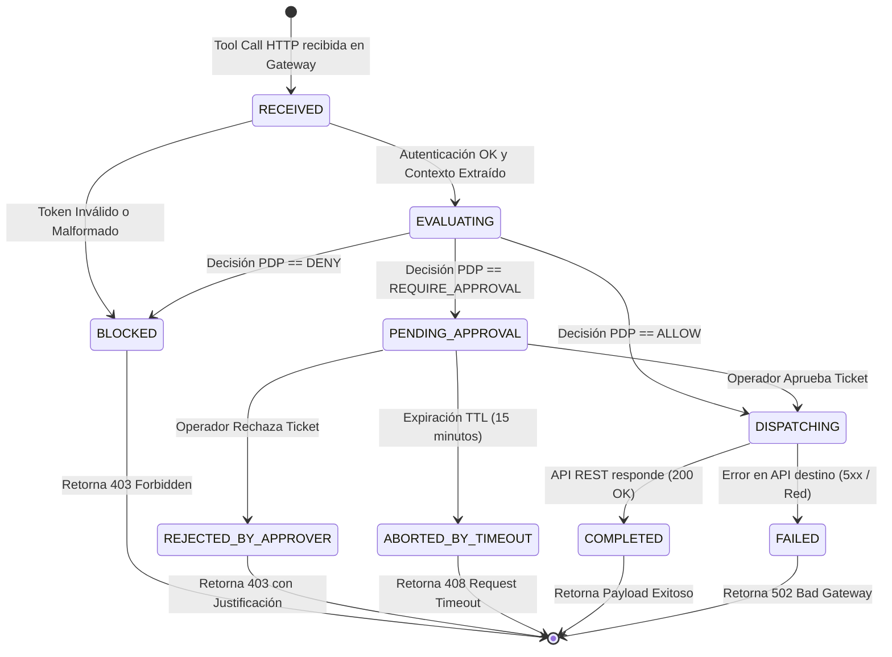
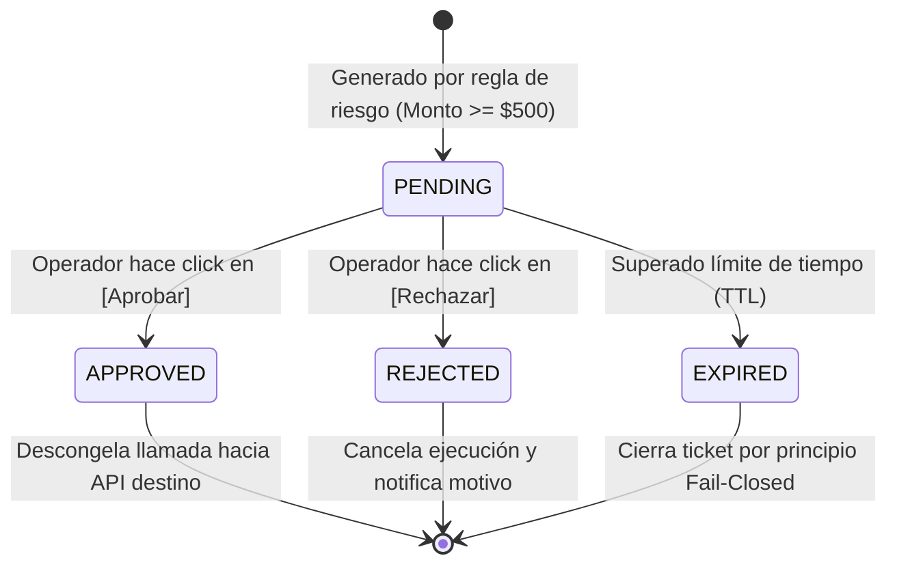
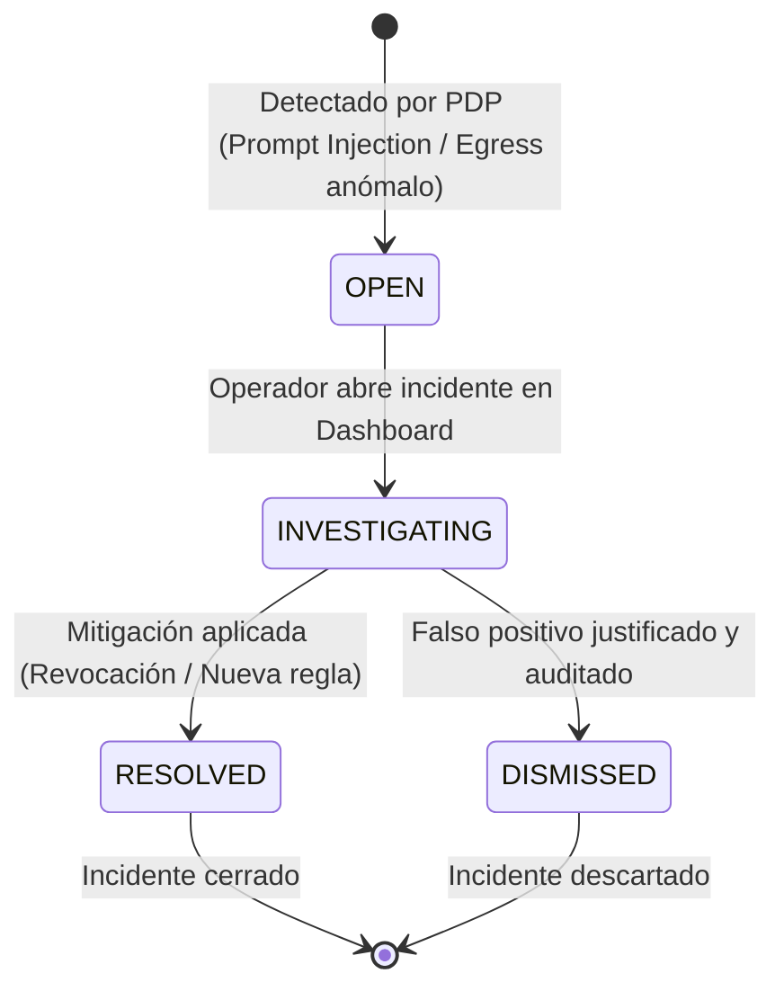

# 🔄 Guía de Defensa: Máquinas de Estados y Ciclo de Vida en Runtime
**Archivo visual opcional (Draw.io):** [`diagramas/agentguard_estados_ciclo_vida.drawio`](./diagramas/agentguard_estados_ciclo_vida.drawio)  
**Proyecto:** AgentGuard — Runtime Authorization & Governance for AI Agents  
**Cátedra:** Desarrollo Web — 5to Semestre, ITU - Universidad Nacional de Cuyo  

---

## 1. Importancia del Modelado de Estados en Arquitecturas Asíncronas

En sistemas distribuidos donde intervienen humanos (*Human-in-the-loop*), las peticiones no siempre son del tipo *Request/Response* sincrónico inmediato. Una llamada interceptada puede quedar suspendida durante minutos a la espera de que un supervisor presione un botón en el navegador.

> **Argumento para el docente:**  
> *«Formalizar el ciclo de vida mediante máquinas de estados UML garantiza que el backend de AgentGuard sea determinista, prevenga condiciones de carrera (*race conditions*) y aplique el principio de **Fail-Closed** ante cualquier contingencia o desconexión».*

---

## 2. Diagramas de Estados UML (Mermaid)

### A. Máquina 1: Ciclo de Vida de una Ejecución (`Execution`)



### B. Máquina 2: Ciclo de Vida de una Aprobación (`Approval`)



### C. Máquina 3: Ciclo de Vida de un Incidente de Seguridad (`Alert`)



---

## 3. Análisis Detallado de las Transiciones

### Máquina 1: Ejecución en Runtime
1. **`RECEIVED`:** La tool call es recibida en el Gateway. Se validan sintaxis y autenticidad del token del agente.
2. **`EVALUATING`:** El PDP toma la tupla contextual y evalúa las políticas cacheadas en Redis.
3. **Bifurcación de Decisión:**
   * **Rama `BLOCKED` (Si la decisión es `DENY`):** Transición terminal inmediata. Se corta la conexión, se devuelve `403 Forbidden` y la herramienta externa jamás es invocada.
   * **Rama `DISPATCHING` (Si la decisión es `ALLOW`):** Se enruta a la API REST de destino. Si esta responde con éxito, culmina en el estado final **`COMPLETED` (200 OK)**.
   * **Rama `PENDING_APPROVAL` (Si la decisión es `REQUIRE_APPROVAL`):** La solicitud se congela en el Gateway, se persiste en base de datos y se dispara la alerta por WebSocket hacia la interfaz del operador humano.
4. **Resolución de la Espera Humana:**
   * Si el operador acepta $\rightarrow$ Transición a `DISPATCHING` $\rightarrow$ `COMPLETED`.
   * Si el operador rechaza $\rightarrow$ Transición a `REJECTED_BY_APPROVER` (403 con motivo explícito).
   * Si vence el TTL $\rightarrow$ Transición a `ABORTED_BY_TIMEOUT` (408 Request Timeout).

---

## 4. Principios de Robustez: Idempotencia y Prevención de Condiciones de Carrera

Durante la defensa, es vital explicar cómo el backend resuelve los problemas de concurrencia:

1. **Bloqueo Optimista / Atómico en Base de Datos:** Cuando dos operadores intentan aprobar la misma solicitud al mismo tiempo, la actualización SQL se realiza mediante una cláusula atómica:
   ```sql
   UPDATE approvals 
   SET status = 'APPROVED', resolved_by_user_id = :userId, resolved_at = NOW() 
   WHERE id = :approvalId AND status = 'PENDING';
   ```
   Si la fila ya no está en `PENDING`, la segunda transacción no afecta registros y recibe un error amigable, impidiendo doble ejecución.
2. **Idempotencia de Invocación:** Si un agente de IA reintenta enviar una petición debido a latencia de red, el Gateway identifica el mismo `request_id` y no duplica la orden de compra ni la devolución.

---

## 5. Preguntas Difíciles del Profesor y Respuestas Sugeridas

### ❓ P1: *"¿Cómo hace el Gateway para mantener al agente esperando mientras el humano aprueba en la web sin agotar las conexiones del servidor?"*
> **Respuesta:** «En Node.js o arquitecturas asíncronas modernas, las conexiones son no bloqueantes basadas en el *Event Loop*. Cuando una llamada entra en `PENDING_APPROVAL`, no se congela un hilo del sistema operativo; se deja una promesa (*Promise*) o suscripción a un canal Redis Pub/Sub a la espera del evento de resolución. Cuando el operador hace click en el frontend, la API publica el evento en Redis y el Gateway despacha la respuesta inmediatamente, consumiendo un mínimo de memoria».

### ❓ P2: *"¿Por qué consideraron el estado `EXPIRED` en lugar de dejar que la aprobación espere indefinidamente?"*
> **Respuesta:** «Por el principio de seguridad **Fail-Closed**. Un agente no puede esperar eternamente porque los modelos y los clientes HTTP tienen tiempos límite de desconexión (*socket timeouts*). Si nadie aprueba una transferencia de dinero en 15 minutos, asumir el silencio como rechazo seguro evita que se ejecuten transacciones fuera de contexto horas más tarde».
