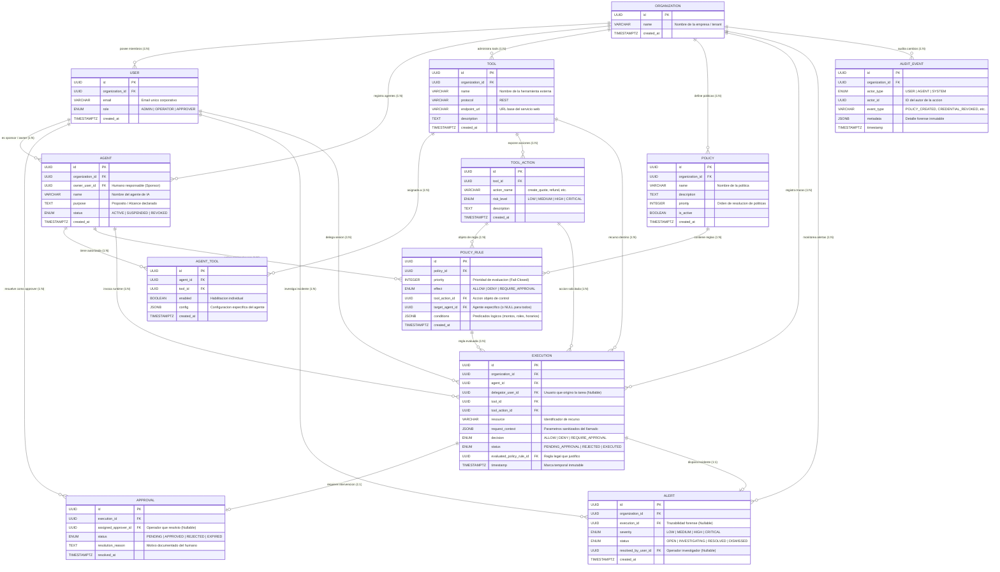

# 🛡️ Guía de Defensa: Modelo Entidad-Relación Relacional Multi-Tenant v2.0
**Archivo visual opcional (Draw.io):** [`diagramas/agentguard_mer_relacional.drawio`](./diagramas/agentguard_mer_relacional.drawio)  
**Proyecto:** AgentGuard — Runtime Authorization & Governance for AI Agents  
**Cátedra:** Desarrollo Web — 5to Semestre, ITU - Universidad Nacional de Cuyo  

---

## 1. Propósito y Alcance del Diagrama

Este diagrama modela la **capa relacional lógica/física** de AgentGuard. Representa cómo la base de datos almacena el estado de las organizaciones, los agentes de IA, las herramientas que consumen, las políticas de autorización contextual y la trazabilidad forense de cada ejecución en tiempo real (*Execution Traces*).

Está optimizado para un motor **PostgreSQL** moderno, combinando la consistencia relacional con campos semiestructurados (`JSONB`) indexados mediante GIN.

---

## 2. Diagrama del Modelo Entidad-Relación (Mermaid)

---

## 3. Decisiones Arquitectónicas y Justificación Técnica

### A. Estrategia Multi-Tenant: Base de Datos Compartida con Discriminador de Tenant
* **Decisión:** Todas las tablas de dominio raíz portan la columna `organization_id (UUID)`.
* **Justificación frente al tribunal:** Para el alcance de un MVP SaaS y arquitectura web ágil, una base de datos con esquema compartido (*Shared Database, Shared Schema*) y discriminador de tenant indexado es el estándar de la industria (utilizado por plataformas como GitHub, Slack o Stripe en sus fases de escala). Permite migraciones de esquema unificadas, minimiza la sobrecarga de conexiones y mantiene costos de infraestructura controlados sin comprometer el aislamiento lógico si se aplican políticas de **Row-Level Security (RLS)** en PostgreSQL.

### B. Uso de UUID v4 como Clave Primaria en lugar de Enteros Seriales
* **Justificación:**
  1. **Prevención de Ataques de Enumeración (Insecure Direct Object References - IDOR):** Un ID incremental secuencial (`/api/v1/agents/1`, `/agents/2`) permite a atacantes o agentes comprometidos deducir la existencia y volumen de otros recursos.
  2. **Generación Descentralizada:** El API Gateway o servicios asíncronos pueden generar identificadores de ejecución sin bloquear transaccionalmente secuencias en la base de datos.
  3. **Seguridad Multi-Tenant:** Dificulta colisiones accidentales entre tenants.

### C. Uso Estratégico de `JSONB` vs. Normalización Extrema
En el modelo observamos `JSONB` en cuatro lugares clave:
1. `PolicyRule.conditions`: Define los predicados dinámicos de evaluación (ej. `{"amount_max": 5000, "allowed_roles": ["sales"], "allowed_hours": "08:00-18:00"}`). Normalizar esto en tablas de atributos clave-valor (EAV) destruiría el rendimiento con decenas de *JOINs* innecesarios en la ruta crítica del gateway.
2. `Execution.request_context`: Metadatos contextuales sanitizados del llamado en runtime (ej. `{"ip": "192.168.1.10", "environment": "production", "delegation_chain": ["user_1", "agent_sales"]}`).
3. `AgentTool.config`: Parámetros específicos de conexión y límites que un agente particular tiene sobre una herramienta.
4. `AuditEvent.metadata`: Datos forenses del evento.

> **Defensa clave:** PostgreSQL ofrece índices invertidos generalizados (**GIN**) sobre columnas `JSONB`, lo que permite realizar consultas indexadas sobre propiedades internas sin perder la flexibilidad requerida por entornos agentic donde los esquemas de herramientas varían constantemente.

### D. Sanitización y Privacidad del `request_context`
* **Defensa:** Cumpliendo con OWASP GenAI (LLM06 - Sensitive Information Disclosure), el gateway aplica una etapa de **sanitización y enmascaramiento (*masking*)** antes de persistir en `Execution`. Se almacenan tipos y montos, pero nunca tokens de acceso, API keys o payloads crudos con información confidencial de clientes.

---

## 4. Las 7 Correcciones y Mejoras de la Versión 2.0

Frente a la primera versión del proyecto, este modelo incorpora mejoras estructurales que deben destacarse durante la presentación:

1. **Relación $N:N$ entre Agente y Herramienta (`AgentTool`):** En la versión inicial un agente tenía herramientas fijas o viceversa. Ahora, una herramienta (ej. *API REST de Salesforce*) puede asignarse a múltiples agentes, cada uno con configuraciones, scopes y estados de habilitación independientes.
2. **Granularidad Fina con `ToolAction`:** Anteriormente se autorizaba la herramienta genérica o mediante un string de texto libre. Ahora se modela la acción atómica (`ToolAction`) con su propio `risk_level` (LOW, MEDIUM, HIGH, CRITICAL), garantizando integridad referencial con FKs.
3. **Mecanismo Determinista de Prioridad y Precedencia:** `Policy` y `PolicyRule` cuentan con un campo `priority (INTEGER)`. La regla fundamental de seguridad es el **Principio de Mínimo Privilegio y Denegación por Defecto (*Fail-Closed*)**: ante un conflicto o empate de reglas, `DENY` siempre vence a `ALLOW`.
4. **Desacoplamiento del Ciclo de Vida de Aprobación (`Approval`):** Las aprobaciones no son un flag booleano en la ejecución, sino una entidad hija con estados (`PENDING`, `APPROVED`, `REJECTED`, `EXPIRED`), asignación de usuario aprobador y motivo de resolución.
5. **Entidad de Seguridad `Alert`:** Permite registrar incidentes anómalos o intentos de violación (ej. *Prompt Injection* detectado) y rastrear quién la investigó (`resolved_by_user_id`).
6. **Separación de `AuditEvent` y `Execution`:** `Execution` almacena llamadas operativas de agentes en runtime; `AuditEvent` audita acciones administrativas humanas (quién creó una política, quién revocó una credencial, quién cambió permisos).
7. **Estandarización 100% RESTful:** Las herramientas externas se registran mediante sus URLs de endpoints HTTP protegidos (`endpoint_url`), métodos HTTP y esquemas de autenticación estándar (Bearer Token / API Key), permitiendo integrar cualquier API web sin dependencias de protocolos propietarios.

---

## 5. Preguntas Difíciles del Profesor y Respuestas Recomendadas

### ❓ P1: *"¿Por qué la tabla `Execution` tiene tantas claves foráneas? ¿No genera dependencia acoplada?"*
> **Respuesta:** «Las claves foráneas en `Execution` son deliberadas: representan la cadena de delegación y auditoría inmutable exigida por estándares de gobernanza agentic (CSA 2026). Necesitamos correlacionar de forma atómica: **Quién solicitó** (`agent_id`), **En nombre de quién** (`delegator_user_id`), **Qué herramienta** (`tool_id`), **Qué acción puntual** (`tool_action_id`) y **Bajo qué regla legal** (`evaluated_policy_rule_id`). Esto asegura integridad referencial y permite consultar trazas forenses instantáneas sin ambigüedades».

### ❓ P2: *"¿Por qué `delegator_user_id` es Nullable en `Execution`?"*
> **Respuesta:** «Porque los agentes de IA pueden operar bajo dos modalidades:
> 1. **Delegación directa:** Un usuario humano le pide al agente que ejecute una tarea (ej. "Prepara un presupuesto para el cliente X"), donde `delegator_user_id` contiene el UUID del usuario.
> 2. **Operación en background / Autónomo:** Un agente programado en un cron nocturno para conciliar catálogos o reintentar transacciones, donde opera de forma autónoma para la organización sin un usuario humano en la sesión».

### ❓ P3: *"Si el volumen de ejecuciones crece exponencialmente, ¿cómo escala la tabla `Execution`?"*
> **Respuesta:** «El diseño está preparado para dos estrategias estándar en bases de datos empresariales:
> 1. **Particionamiento por Rango de Fechas:** Particionar la tabla `Execution` mensualmente sobre la columna `timestamp`.
> 2. **Separación de Almacenamiento Frío/Caliente:** Mantener las ejecuciones de los últimos 30 días en PostgreSQL para el dashboard operativo, y archivar trazas históricas en un *data lake* o almacenamiento columnar mediante procesos en segundo plano (*Audit Service*), tal como lo contempla la arquitectura propuesta».
