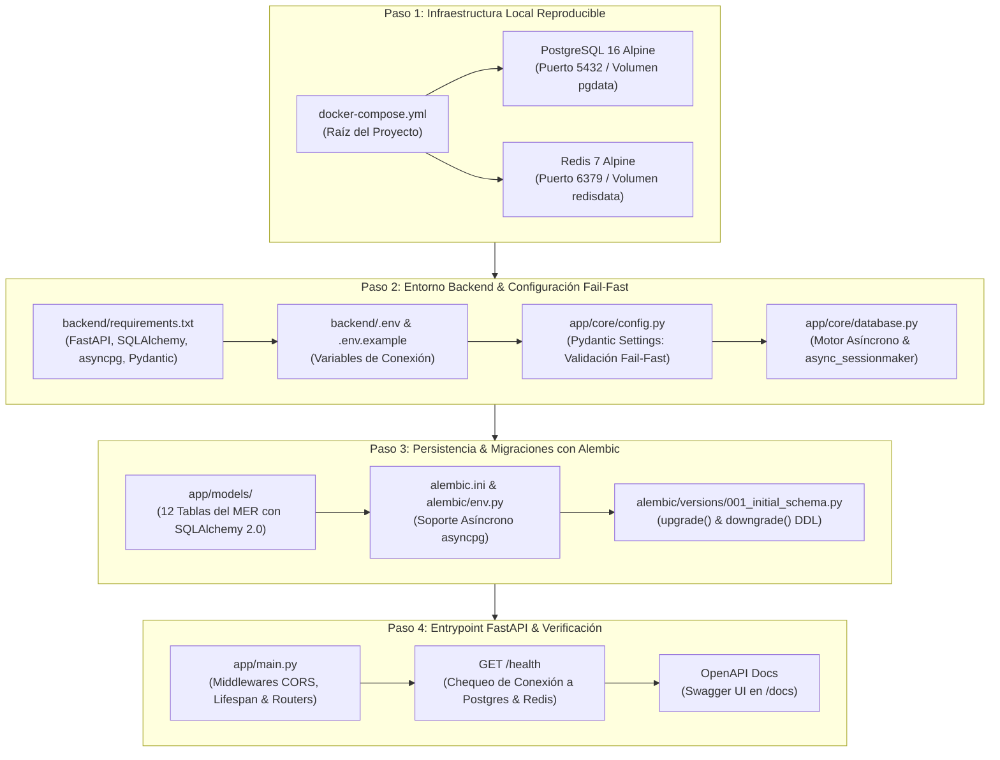

# 📑 Desglose de Pasos: Semana 1 — Base de Datos & Setup Inicial

> **Documento de Especificación Técnica y Justificación para la Defensa Académica**  
> **Módulo:** `backend/`  
> **Proyecto:** AgentGuard — Runtime Authorization & Governance for AI Agents  
> **Cátedra:** Desarrollo Web (5to Semestre) — ITU / Universidad Nacional de Cuyo  
> **Autores / Responsables:** Agustín Belardinelli (PO / Lógica Core) & Jonathan Araujo (Arquitectura Backend / Persistencia)  
> **Estado:** Aprobado para ejecución  

---

## 🎯 Objetivo de la Semana 1
Establecer los cimientos reproducibles, robustos y formalmente versionados del backend de AgentGuard. Al finalizar esta semana, el equipo contará con:
1. Una infraestructura de base de datos relacional y caché volátil completamente automatizada mediante Docker.
2. Un entorno de desarrollo en Python 3.12 con FastAPI estructurado bajo buenas prácticas de ingeniería de software.
3. El esquema relacional completo de **12 tablas** ([agentguard_mer_relacional.md](../agentguard_mer_relacional.md)) mapeado en SQLAlchemy 2.0 y versionado formalmente mediante migraciones de **Alembic**.
4. Un endpoint de verificación (`GET /health`) y la documentación viva interactiva en OpenAPI/Swagger operativa.

---

## 🧭 Diagrama de Flujo de los 4 Pasos



---

## 🔬 Desglose Paso a Paso: Qué Hacemos y Por Qué

---

### 🧱 PASO 1: Infraestructura Local Reproducible (`docker-compose.yml`)

#### ¿Qué se hace concretamente?
1. Se crea el archivo `docker-compose.yml` en la raíz del repositorio (`C:\Users\jonat\Downloads\Codigos\AgentGuard\docker-compose.yml`).
2. Se definen dos servicios contenerizados con imágenes oficiales ligeras basadas en Alpine Linux:
   * **`postgres`**: Servicio de base de datos relacional principal.
     * Imagen: `postgres:16-alpine`.
     * Puerto expuesto: `5432:5432`.
     * Base de datos: `agentguard_db`.
     * Usuario: `agentguard` | Contraseña: `agentguard_secret`.
     * Volumen persistente: `pgdata:/var/lib/postgresql/data` (los datos no se pierden al apagar los contenedores).
     * `healthcheck`: Comando `pg_isready -U agentguard -d agentguard_db` para asegurar disponibilidad real antes de recibir tráfico.
   * **`redis`**: Servicio de caché en memoria de alta velocidad.
     * Imagen: `redis:7-alpine`.
     * Puerto expuesto: `6379:6379`.
     * Volumen persistente: `redisdata:/data`.
     * Parámetro de persistencia: `--appendonly yes` (AOF para no perder estados en reinicios).
     * `healthcheck`: Comando `redis-cli ping`.
3. Se define una red interna puente (`agentguard-net`) para intercomunicación aislada.

#### ¿Por qué es necesaria cada tecnología y qué rol cumple?
* **Docker & Docker Compose:**
  * *¿Por qué se usa?* Garantiza la **reproducibilidad ambiental absoluta**. Evita el clásico problema de *«en mi máquina funciona»*. Cada uno de los 4 integrantes del equipo (y el profesor al evaluar el proyecto) puede clonar el repositorio y levantar exactamente la misma base de datos con un único comando (`docker compose up -d`), sin necesidad de instalar servicios pesados de fondo en Windows.
  * *Argumento para la cátedra:* Demuestra adopción de estándares de la industria DevOps, desacoplando el código de la infraestructura física del host.
* **PostgreSQL 16 (Alpine):**
  * *¿Por qué se usa?* Es el motor relacional Open Source más avanzado y confiable del mundo. Soporta transacciones ACID estrictas, llaves foráneas en cascada y aislamiento por tenant (`organization_id`).
  * *Capacidad clave para AgentGuard:* Su soporte nativo para **`JSONB` e índices GIN**. Las políticas de seguridad contextuales (`conditions`), la configuración de herramientas (`config`) y el contexto de llamadas de los agentes (`request_context`) son semiestructurados. Postgres permite almacenarlos en formato binario indexado, ofreciendo la flexibilidad de una base NoSQL sin perder la integridad referencial de una base relacional.
  * *¿Por qué Alpine?* Reduce el peso de la imagen de ~400 MB a menos de 80 MB, acelerando la descarga y el inicio.
* **Redis 7 (Alpine):**
  * *¿Por qué se usa?* Es un motor de almacenamiento en memoria (*in-memory key-value store*) con latencias de respuesta en microsegundos (< 1 ms).
  * *Rol en la arquitectura de AgentGuard:*
    1. **Caché volátil de políticas del PDP:** Cuando el agente de IA realiza una llamada de herramienta en tiempo de ejecución, el gateway (PEP) debe evaluar la regla en milisegundos. Consultar PostgreSQL en cada llamada genera latencia y cuellos de botella; Redis permite cachear las políticas activas del agente en RAM.
    2. **Manejo de estados transitorios y sesiones:** Para la bandeja de intervención humana (HITL) en tiempo real (Semana 5).

---

### 🐍 PASO 2: Entorno Backend & Configuración Fail-Fast (`backend/`)

#### ¿Qué se hace concretamente?
1. Se define el archivo `backend/requirements.txt` con versiones bloqueadas de las dependencias requeridas:
   ```text
   fastapi>=0.111.0,<0.112.0
   uvicorn[standard]>=0.30.0,<0.31.0
   sqlalchemy[asyncio]>=2.0.30,<2.1.0
   asyncpg>=0.29.0,<0.30.0
   pydantic>=2.7.0,<2.8.0
   pydantic-settings>=2.3.0,<2.4.0
   alembic>=1.13.0,<1.14.0
   redis>=5.0.0,<5.1.0
   httpx>=0.27.0,<0.28.0
   pytest>=8.2.0,<8.3.0
   pytest-asyncio>=0.23.0,<0.24.0
   ```
2. Se crean los archivos de variables de entorno:
   * `backend/.env.example`: Plantilla pública sin credenciales sensibles para control de versiones en Git.
   * `backend/.env`: Archivo local con las credenciales de desarrollo.
3. Se implementa `backend/app/core/config.py`:
   * Utiliza `pydantic_settings.BaseSettings`.
   * Carga y valida tipos de datos: `PROJECT_NAME`, `API_V1_STR`, `POSTGRES_SERVER`, `POSTGRES_PORT`, `POSTGRES_USER`, `POSTGRES_PASSWORD`, `POSTGRES_DB`, `REDIS_URL`, etc.
   * Construye de manera determinista la URI asíncrona de la base de datos: `postgresql+asyncpg://...`.
   * **Principio Fail-Fast:** Si falta alguna variable obligatoria o tiene un formato inválido, el servidor se rehúsa a iniciar y emite un mensaje de error claro en consola, evitando fallas silenciosas en tiempo de ejecución.
4. Se implementa `backend/app/core/database.py`:
   * Instancia el motor asíncrono con `create_async_engine(settings.SQLALCHEMY_DATABASE_URI, echo=False)`.
   * Configura la fábrica de sesiones asíncronas con `async_sessionmaker(bind=engine, class_=AsyncSession, expire_on_commit=False)`.
   * Define la clase base declarativa tipada `class Base(DeclarativeBase)`.
   * Provee la función generadora de dependencias `get_db()` para inyectar sesiones en los endpoints de FastAPI (`Depends(get_db)`).

#### ¿Por qué es necesaria cada tecnología y qué rol cumple?
* **Python 3.12+:**
  * *¿Por qué se usa?* Cumple con la directiva explícita de la cátedra de adoptar una **arquitectura políglota** (lenguajes distintos en frontend y backend) para demostrar dominio de integración heterogénea. Python 3.12 incorpora mejoras de rendimiento sustanciales en el intérprete (~5-10% más rápido que 3.11), sintaxis de tipos moderna (`type` statement de PEP 695) y es el lenguaje por excelencia para construir herramientas de gobernanza e integración con modelos de Inteligencia Artificial.
* **FastAPI:**
  * *¿Por qué se usa?* Es el framework web ASGI más moderno y veloz de Python.
  * *Ventajas clave:*
    1. **Asincronía nativa (`async`/`await`):** Puede manejar miles de peticiones concurrentes de agentes sin bloquear subprocesos del sistema operativo.
    2. **Generación automática de OpenAPI/Swagger:** Genera la documentación interactiva viva en `/docs` sin escribir una sola línea de documentación manual.
    3. **Inyección de dependencias:** Permite inyectar sesiones de base de datos, servicios de autenticación y clientes de Redis de manera desacoplada y testeable.
* **Uvicorn:**
  * *¿Por qué se usa?* Es el servidor web ASGI de grado de producción basado en `uvloop` y `httptools`. Es el puente que ejecuta la aplicación FastAPI sobre el protocolo HTTP/1.1 y WebSockets con un bucle de eventos de ultra alto rendimiento en C.
* **Pydantic v2 & Pydantic-Settings:**
  * *¿Por qué se usa?* Pydantic v2 reescribió su núcleo de validación en Rust, haciéndolo entre 5x y 10x más rápido que la versión anterior. Centraliza la validación de payloads HTTP y la configuración del entorno, garantizando que ningún dato corrupto ingrese a la lógica de negocio.
* **SQLAlchemy 2.0 (Estilo Declarativo Moderno):**
  * *¿Por qué se usa?* Es el ORM estándar de facto en Python. En la versión 2.0, SQLAlchemy adoptó una sintaxis 100% tipada mediante `Mapped[T]` y `mapped_column()`, eliminando ambigüedades y permitiendo que linters y el autocompletado del IDE detecten errores de tipo en tiempo de edición.
* **asyncpg:**
  * *¿Por qué se usa?* Es el driver PostgreSQL asíncrono más rápido disponible para Python. A diferencia de `psycopg2` (que es síncrono y bloqueante) o de wrappers genéricos, `asyncpg` se comunica directamente con PostgreSQL mediante su protocolo binario nativo, evitando serializaciones innecesarias.

---

### 🗄️ PASO 3: Modelos Declarativos y Versionado DDL con Alembic (`backend/alembic/`)

#### ¿Qué se hace concretamente?
1. Se mapean las **12 tablas relacionales del MER formal** ([agentguard_mer_relacional.md](../agentguard_mer_relacional.md)) en clases Python dentro de `backend/app/models/`:
   * `organizations`: Tenants del sistema SaaS.
   * `users`: Miembros con roles (`ADMIN`, `SECURITY_OFFICER`, `APPROVER`, `AUDITOR`, `VIEWER`).
   * `agents`: Identidades de IA registradas y sus sponsors humanos.
   * `agent_tools`: Tabla intermedia N:N entre agentes y herramientas con su configuración (`config JSONB`).
   * `tools`: Herramientas o servicios externos registrados (ej. Stripe, Salesforce, Base de Datos).
   * `tool_actions`: Acciones atómicas protegidas con nivel de riesgo (`LOW`, `MEDIUM`, `HIGH`, `CRITICAL`).
   * `policies`: Contenedores de políticas de autorización contextual.
   * `policy_rules`: Reglas atómicas deterministas con condiciones JSONB y prioridad.
   * `executions`: Registro inmutable de cada intento de llamada (`ALLOW`, `DENY`, `REQUIRE_APPROVAL`).
   * `approvals`: Bandeja de intervenciones humanas en espera (HITL).
   * `alerts`: Notificaciones e incidentes de seguridad disparados.
   * `audit_events`: Registro forense inmutable de acciones administrativas.
2. Se implementan los requisitos de diseño relacional:
   * **Claves primarias:** `UUID v4` generadas por defecto (`uuid.uuid4`).
   * **Discriminador multi-tenant:** `organization_id` como clave foránea en todas las entidades subordinadas.
   * **Índices GIN:** Sobre las columnas semiestructuradas de tipo `JSONB` (`conditions`, `request_context`, `config`, `metadata`).
   * **Borrado lógico y restricciones:** `ondelete="CASCADE"` y `ondelete="RESTRICT"` según la regla de dominio.
3. Se inicializa y configura **Alembic**:
   * Archivo `backend/alembic.ini`.
   * Archivo `backend/alembic/env.py` adaptado para conectarse de forma asíncrona mediante `asyncpg` y registrar la metadata de los modelos (`target_metadata = Base.metadata`).
4. Se crea la **migración inicial versionada**:
   * Archivo `backend/alembic/versions/001_initial_schema.py`.
   * Contiene la función `upgrade()` (crea tipos enum, tablas, índices y foreign keys) y la función `downgrade()` (elimina en orden inverso para reversiones limpias).

#### ¿Por qué es necesaria cada tecnología y qué rol cumple?
* **Alembic (ADR-005 en [DECISIONS.md](../DECISIONS.md)):**
  * *¿Por qué no usar simplemente `Base.metadata.create_all()`?*
    * `create_all()` es una práctica de juguete: crea las tablas si no existen, pero **no puede alterar columnas, no puede agregar índices nuevos, no permite volver atrás si una migración falla, y no deja ningún rastro en Git de cómo evolucionó la base de datos**.
    * En un entorno profesional y ante el tribunal de evaluación de la cátedra, la base de datos se gestiona como **código fuente versionado**. Alembic crea una tabla de control llamada `alembic_version` en PostgreSQL. Cada cambio de esquema se representa como un archivo Python con un hash identificador, permitiendo auditoría, trabajo en equipo concurrente sin pisarse y despliegues continuos seguros.
* **UUID v4 (Universally Unique Identifiers):**
  * *¿Por qué se usa en vez de enteros autoincrementales (`SERIAL` / `BIGINT`)?*
    1. **Seguridad contra ataques IDOR (*Insecure Direct Object References*):** Un atacante no puede adivinar la siguiente entidad cambiando `id=12` por `id=13` en la URL.
    2. **Generación descentralizada:** El backend, el gateway o los microservicios pueden generar la clave primaria en memoria antes de persistir, sin necesidad de esperar a que la base de datos asigne el ID.
    3. **Facilidad de exportación y semillas:** No hay colisiones de IDs al migrar datos entre entornos de desarrollo y producción.
* **JSONB con Índices GIN en PostgreSQL:**
  * *¿Por qué se usa?* `JSONB` almacena datos JSON descompuestos en un formato binario optimizado para lectura y consulta directa. Un índice GIN (*Generalized Inverted Index*) permite ejecutar consultas complejas como `WHERE conditions @> '{"amount_gt": 1000}'` en milisegundos, permitiendo que el motor de políticas de AgentGuard evalúe reglas dinámicas sin requerir esquemas rígidos e inalterables.

---

### 🚀 PASO 4: Entrypoint FastAPI, Middlewares y Verificación (`backend/app/main.py`)

#### ¿Qué se hace concretamente?
1. Se crea el archivo `backend/app/main.py` como punto de entrada de la aplicación FastAPI.
2. Se configura el ciclo de vida asíncrono de la aplicación mediante `@asynccontextmanager async def lifespan(app: FastAPI)`:
   * Al iniciar: Verifica la conectividad con PostgreSQL y Redis, registrando el estado en logs.
   * Al apagar: Cierra limpiamente el pool de conexiones del motor SQLAlchemy y la conexión a Redis.
3. Se configuran los middlewares esenciales:
   * **`CORSMiddleware`**: Permite peticiones cruzadas desde el frontend de desarrollo (`http://localhost:5173` para Vite/React) permitiendo cabeceras, credenciales y todos los métodos HTTP (`GET`, `POST`, `PUT`, `DELETE`, etc.).
   * Middleware de captura de excepciones no controladas para evitar fugas de información interna en respuestas 500.
4. Se implementan los endpoints de diagnóstico:
   * `GET /health`: Retorna `{ "status": "ok", "version": "1.0.0", "database": "connected", "redis": "connected" }`.
   * `GET /api/v1/ping`: Ping rápido para monitoreo de latencia.
5. Se verifica el funcionamiento completo ejecutando:
   * Levantamiento de contenedores: `docker compose up -d`.
   * Ejecución de migraciones: `alembic upgrade head`.
   * Inicio del servidor: `uvicorn app.main:app --reload`.
   * Validación del navegador: Acceso a `http://localhost:8000/docs` para visualizar Swagger UI.

#### ¿Por qué es necesaria cada tecnología y qué rol cumple?
* **CORS (Cross-Origin Resource Sharing):**
  * *¿Por qué se usa?* Al tratarse de una arquitectura desacoplada donde el Frontend corre en un origen (`http://localhost:5173`) y el Backend en otro (`http://localhost:8000`), el navegador bloquea las solicitudes HTTP por razones de seguridad a menos que el servidor devuelva las cabeceras `Access-Control-Allow-Origin` adecuadas.
* **Manejador de Ciclo de Vida (`lifespan`):**
  * *¿Por qué se usa?* En versiones modernas de FastAPI, los eventos antiguos `@app.on_event("startup")` están deprecados. El protocolo de contexto asíncrono `lifespan` es el estándar oficial para inicializar y liberar conexiones compartidas de forma limpia y sin fugas de memoria (*resource leaks*).
* **Swagger UI / OpenAPI 3.1:**
  * *¿Por qué se usa?* Proporciona una interfaz web interactiva que permite a cualquier miembro del equipo (y al profesor en la defensa) probar inmediatamente cada endpoint sin necesidad de abrir herramientas externas como Postman.

---

## 📊 Matriz Resumen de Tecnologías y Roles para la Defensa

| Tecnología | Versión | Rol en AgentGuard | Justificación Técnica para la Cátedra |
| :--- | :--- | :--- | :--- |
| **Docker Compose** | v2+ | Orquestación de infraestructura local | Reproducibilidad sin fricción para cualquier evaluador o desarrollador. |
| **PostgreSQL** | 16 (Alpine) | Persistencia relacional multi-tenant | Motor ACID robusto, llaves foráneas estrictas y soporte nativo `JSONB` con GIN. |
| **Redis** | 7 (Alpine) | Almacén volátil en memoria | Latencia <1 ms para caché de políticas del PDP y futuras notificaciones WebSockets. |
| **Python** | 3.12+ | Runtime del Backend | Cumplimiento del requisito políglota de la cátedra; lenguaje nativo para ecosistema IA. |
| **FastAPI** | 0.111+ | Framework Web REST | Asincronía de alto rendimiento, validación de esquemas y documentación OpenAPI viva. |
| **Uvicorn** | 0.30+ | Servidor ASGI | Servidor web con bucle de eventos C de ultra baja latencia. |
| **Pydantic** | v2.7+ | Validación y Tipado | Núcleo en Rust ultra veloz; validación *fail-fast* de configuración y payloads. |
| **SQLAlchemy** | 2.0+ (Async) | ORM Declarativo | Tipado estático con `Mapped`, consultas asíncronas y prevención de inyección SQL. |
| **asyncpg** | 0.29+ | Driver PostgreSQL | Conexión binaria asíncrona directa con Postgres sin bloquear el event loop. |
| **Alembic** | 1.13+ | Versionado DDL de BD | Trazabilidad de cambios de esquema en Git con capacidad de reversión (*downgrade*). |
| **UUID v4** | Estándar RFC 4122 | Claves Primarias | Prevención de ataques IDOR y generación descentralizada por microservicios. |

---

## 🛠️ Guía Rápida de Comandos para Ejecutar la Semana 1

Cuando comencemos a ejecutar los pasos, los comandos a ejecutar en la terminal de desarrollo serán:

### 1. Levantar Servicios de Infraestructura (Paso 1)
```bash
# Desde la raíz del repositorio
docker compose up -d

# Verificar que los contenedores estén saludables ("healthy")
docker compose ps
```

### 2. Preparar el Entorno Virtual de Python (Paso 2)
```bash
# Entrar al directorio del backend
cd backend

# Crear entorno virtual de Python 3.12
python -m venv .venv

# Activar el entorno virtual (Windows PowerShell)
.venv\Scripts\Activate.ps1

# Instalar dependencias congeladas
pip install -r requirements.txt
```

### 3. Ejecutar las Migraciones de Base de Datos (Paso 3)
```bash
# Aplicar el esquema relacional completo a PostgreSQL
alembic upgrade head

# Verificar el estado de la versión actual
alembic current
```

### 4. Iniciar el Servidor de Desarrollo (Paso 4)
```bash
# Iniciar Uvicorn con recarga en caliente
uvicorn app.main:app --reload --port 8000

# Probar en el navegador
# Healthcheck: http://localhost:8000/health
# Swagger UI:   http://localhost:8000/docs
```

---

## 📌 Próxima Acción Inmediata
Con esta especificación aprobada, el paso siguiente es ejecutar el **Paso 1**: crear el archivo [docker-compose.yml](../docker-compose.yml) en la raíz del repositorio y levantar los contenedores de PostgreSQL 16 y Redis 7.
